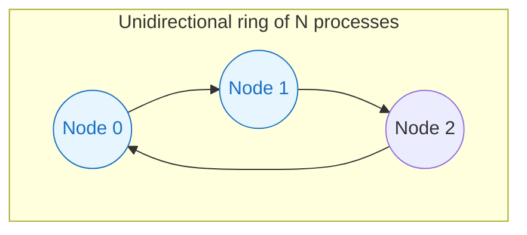
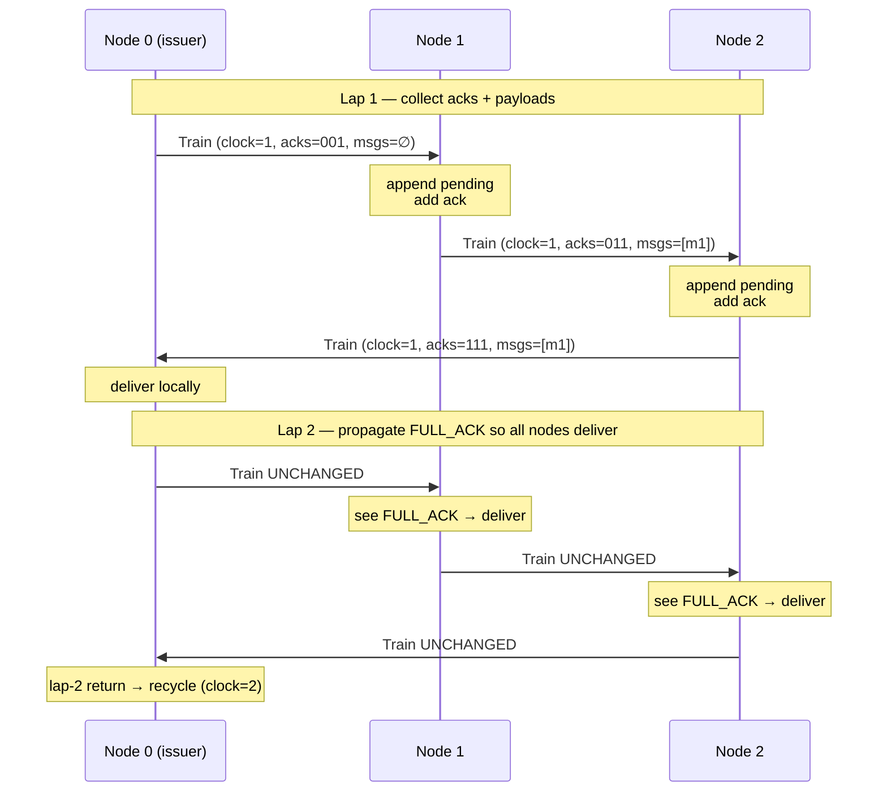
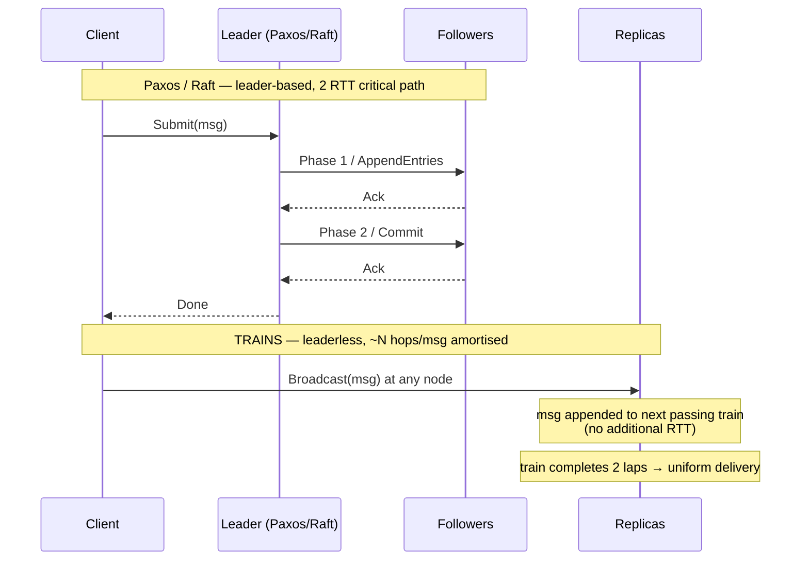
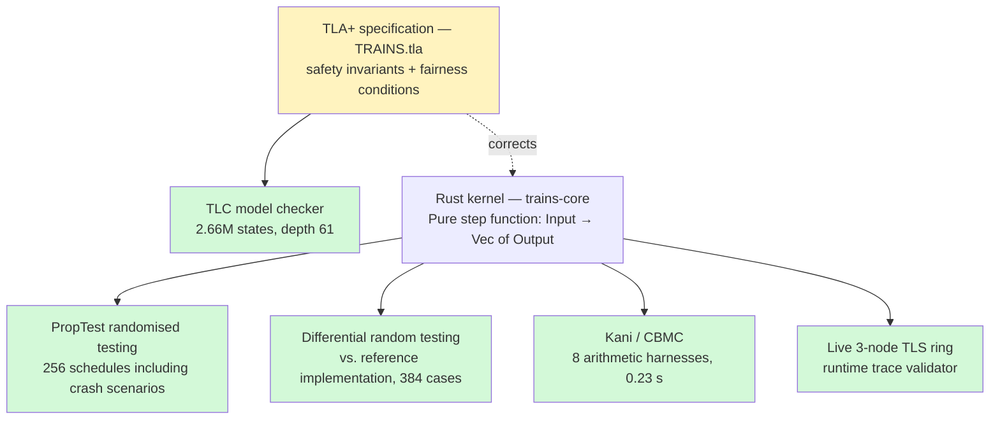
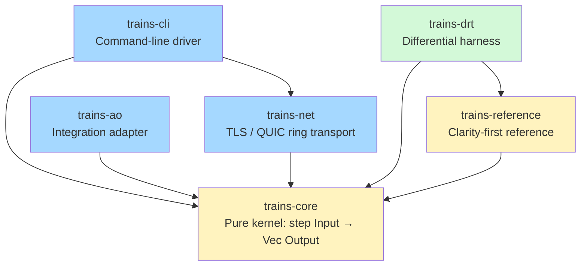

# A TLA⁺-verified implementation of the TRAINS protocol

*A replication study: formal specification, model checking, and
multi-layer verification of a ring-based uniform total-order broadcast
algorithm.*

---

## Overview

Simatic et al. (2015) introduced TRAINS ("Throughput-efficient uniform
total order broadcast"), a ring-based protocol in which circulating
*token-trains* replace the leader election found in Paxos and Raft.
Each train carries a batch of messages and an acknowledgement bitmap;
once every process has acknowledged a train, its messages become
eligible for delivery in a globally consistent order. Multiple
concurrent trains provide pipeline parallelism around the ring,
allowing throughput to scale with the number of train slots.

This document reports on a replication study in which we

1. wrote a complete Rust implementation of TRAINS from the 2015 paper,
2. constructed a TLA⁺ formal specification and checked it with TLC,
3. applied Kani (CBMC-backed) bounded verification to the
   protocol kernel's arithmetic primitives, and
4. ran a differential random-testing harness comparing the production
   implementation against a clarity-first reference.

The goal was to understand how a four-layer verification stack interacts
with a non-trivial distributed protocol, and in particular what each
layer catches that the others miss. All specification errors and
implementation discrepancies described below were introduced during our
formalisation effort; they concern the gap between the paper's
informal description and our TLA⁺ encoding, not deficiencies in the
algorithm itself.

---

## Background: uniform total-order broadcast families

> **Uniform TOB**: every correct process delivers the same set of
> messages in the same order; a message delivered by any process
> (including one that later crashes) is eventually delivered by all
> correct processes.

This is the strong primitive underlying state-machine replication and
distributed databases. Three broad protocol families address it with
different trade-offs:

| Family | Examples | Primary optimisation | Liveness |
|--------|----------|----------------------|----------|
| **Quorum / consensus** | Paxos, Raft | Fault tolerance | Survives ⌊(N−1)/2⌋ crashes |
| **Atomic broadcast** | ISIS, Spread, ABCast | Latency | Quorum-style |
| **Ring / token-passing** | TRAINS, BBOBB, ToTo | **Throughput** | UTO — halts on first crash |

Ring protocols occupy a well-defined niche: small, stable clusters
where throughput dominates and a coordinated shutdown on failure is
acceptable. Examples include trade-execution engines, real-time
audio/video bridging, and high-frequency log-shipping fan-out. Within
that envelope, Simatic's benchmarks showed TRAINS scaling
messages-per-second linearly with the number of concurrent train slots,
a property leader-based protocols cannot match because the leader
concentrates forwarding, acknowledgement collection, and ordering work.

### Protocol lineage

The conceptual foundation is Flaviu Cristian's: atomic broadcast as the
basis of synchronous replicated storage [Cristian et al. 1995] and
processor-group membership as agreement on a consistent sequence of views
[Cristian 1991]. Cristian advised the original project in its early phase,
so the influence was direct. The *data-train* mechanism itself was reduced to practice
in industry and patented in the mid-1990s — *Method of broadcasting data by
means of a data train* [US 5,483,520 A, Eychenne & Simatic, Cegelec, granted
1996], which already described a train of data "cars" circulating a ring with
recovery of the ring path on node failure, with replicated objects layered on
top [US 5,488,723 A, 1996; Eychenne & Simatic et al., ACM 1992].

The protocol was then revived and formalised academically. TRAINS emerged
from Simatic's 2012 doctoral thesis at the Conservatoire National des Arts et
Métiers (CNAM), Paris [Simatic 2012], which
introduced the concept of circulating train tokens as a mechanism for
efficient uniform total-order broadcast and demonstrated correctness
informally. The 2015 conference paper [Simatic et al. 2015] refined the
algorithm, formalised the throughput model, and published the first
experimental evaluation.

The immediate sequel is BBOBB ("A total order broadcast algorithm
achieving low latency and high throughput"), presented by Simatic and
Tellier at DSN 2016 [Simatic & Tellier 2016]. TRAINS was explicitly
designed to maximise throughput at the cost of higher latency: a message
must wait for its train slot to complete a full ring tour before it is
eligible for delivery. BBOBB addresses this trade-off, targeting
simultaneously low latency and high throughput, in particular for small
application messages. Both protocols operate on a virtual ring topology.

To our knowledge, no further publications extending or building
directly on the TRAINS/BBOBB line have appeared since 2016. The
dominant ring-based work cited in the broader literature of that period
is Ring Paxos [Marandi et al. 2010], which takes a different approach
(Paxos instances ordered by a ring coordinator rather than circulating
tokens). The TRAINS GitHub repository [simatic/TrainsProtocol] remains
publicly accessible.

---

## The algorithm



Two of the three nodes above own a train slot (`NumTrains = 2`). Each
circulating train carries:

```
Train {
    issuer:   ProcId,    // slot owner
    clock:    u64,       // strictly increasing per issuer
    payloads: Vec<Msg>,  // messages appended around the ring
    ack_bits: u32,       // acknowledgement bitmap (supports up to 30 nodes)
}
```

Delivery proceeds in two laps. On the first lap the train accumulates
payloads and acknowledgements; once every process has acknowledged
(`ack_bits == 0b111`), the issuer delivers locally and forwards the
closed train unchanged. The second lap propagates that closed state so
every other process can deliver the identical message set in
`(clock, issuer)` lexicographic order.



The two-lap scheme is essential to uniform total-order: without it,
each process would deliver a different snapshot of the train depending
on the moment it personally advanced the acknowledgement bitmap to
FULL_ACK, violating the `ConsistentDelivery` invariant.

---

## Comparison with Paxos and Raft



| Dimension | Paxos | Raft | TRAINS |
|-----------|-------|------|--------|
| Leadership | Optional fast-path leader | Mandatory leader | None |
| Failure model | Survives ⌊(N−1)/2⌋ crashes | Survives ⌊(N−1)/2⌋ crashes | Halts on first crash (UTO) |
| Critical path | 2 RTT | 1 RTT (steady state) | 2 ring-laps |
| Message complexity | O(N) per message | O(N) per message | O(N) amortised over batch |
| Throughput ceiling | Leader CPU and bandwidth | Leader bandwidth | Ring bandwidth × NumTrains |
| Primary use case | CFT replication | CFT replication | High-throughput broadcast |

A notable structural difference is load distribution. In leader-based
protocols, the leader performs O(N) times the per-message work of each
follower (forwarding, acknowledgement collection, sequencing). TRAINS
distributes these responsibilities symmetrically around the ring: each
node forwards, acknowledges, and delivers the same volume of traffic.
On homogeneous hardware this recovers the capacity that would otherwise
be consumed by the leader.

---

## Verification approach

Distributed protocols are difficult to validate exhaustively because
correctness violations typically depend on specific process interleavings
that functional tests do not exercise by construction. We applied four
complementary verification methods, each targeting a different failure
class:



- **TLC** exhaustively explores finite state-space instances of the
  TLA⁺ specification and reports counterexample traces for violated
  invariants.
- **PropTest** generates random input schedules (including crash events)
  and shrinks any failing case to a minimal reproducer.
- **Differential random testing (DRT)** runs identical inputs through
  the production implementation and a clarity-first reference in
  parallel, flagging divergences.
- **Kani** applies CBMC bounded model checking to individual leaf
  functions, proving arithmetic properties exhaustively within fixed
  bounds.

---

## Findings from the TLA⁺ specification

TLC explored 2,661,628 states (at model size N=3, K=2) in approximately
25 seconds and identified three encoding errors in our initial
TLA⁺ specification:

### Error 1 — operator precedence

```diff
- doneKeys \in [Procs -> SUBSET (0..MaxClock \X Procs)]
+ doneKeys \in [Procs -> SUBSET ((0..MaxClock) \X Procs)]
```

Without the inner parentheses, `0..MaxClock \X Procs` was parsed as
`0..(MaxClock \X Procs)` — applying integer range syntax to a set of
tuples. TLC reported a type error immediately.

### Error 2 — missing length guard in `IsPrefix`

```diff
- IsPrefix(s, t) == SubSeq(t, 1, Len(s)) = s
+ IsPrefix(s, t) == Len(s) <= Len(t) /\ SubSeq(t, 1, Len(s)) = s
```

`SubSeq(<<>>, 1, 1)` is undefined in TLA⁺ when the sequence is empty.
The missing guard caused TLC to raise an evaluation error whenever one
process's delivery log was empty and another's was not.

### Error 3 — a delivery-ordering invariant

This was the most instructive finding, and the one that had a direct
consequence for the Rust implementation.

Our initial formulation of `AllPriorDelivered(p, ck)` queried only
the *current* state of each train slot to determine whether all
smaller keys had been delivered. TLC produced a 7-step counterexample
trace in which:

```
delivered[0] = <<m1, m2>>   (node 0 delivered key (1,0) then (2,1))
delivered[1] = <<m1, m3>>   (node 1 delivered key (1,0) then (2,0))
```

The mutual-prefix invariant was violated: the two nodes had delivered
different messages in different orders. The mechanism: slot 2 advanced
to key `(2, 1)` while slot 1 was still at `(1, 0)`; node 0 delivered
`(2, 1)` because no smaller key appeared to be in flight yet; slot 1
then issued key `(2, 0)`, which node 1 delivered first, producing a
permanent divergence.

The two-lap scheme described in the original paper is the correct
solution to this problem: a train must complete a full second
circulation before any process delivers its messages, ensuring that
the complete, globally-agreed message set is visible to every node
before delivery occurs. Our initial specification had not captured
this invariant fully in `AllPriorDelivered`.

The fix required two additions to the spec:

1. **Global key tracking**: every `(clock, issuer)` pair ever stamped
   on a train slot is recorded in `issuedKeys`; `AllPriorDelivered`
   checks that every smaller issued key has been delivered before
   permitting the current one.
2. **Issuer clock guard**: at delivery time, every issuer's `issClk`
   must be at least as large as the candidate key's clock, preventing
   a lagging slot from later issuing a smaller-keyed train that would
   retroactively violate the order.

Our initial Rust implementation reflected the same misunderstanding:
the `seen_clocks_advanced_enough` heuristic was skipping issuers from
which no train had yet been received, which is precisely the scenario
the TLC trace exposed. Correcting the TLA⁺ spec first made the
corresponding Rust fix straightforward and gave us a clear criterion
to test against.

---

## Findings from differential random testing

After the TLA⁺ specification was corrected, the DRT harness ran
384 randomly-generated schedules (including crash events and duplicate
broadcasts) through both the production implementation and the reference
side by side. Two discrepancies were detected:

1. **Bootstrap clock-gap handling.** The production implementation
   declares a crash when a train arrives with `clock > prev + 1`,
   including the bootstrap case where `prev = 0` (no train yet
   observed). The reference implementation checked this condition only
   when `prev > 0`. PropTest shrunk the failing case to a single-event
   schedule.

2. **Broadcast-deduplication.** The TLA⁺ spec includes the precondition
   `m ∉ broadcast` on `AppBroadcast`, preventing a process from
   re-broadcasting a message it has already seen. The production
   implementation tracks every `(sender, seq)` pair observed; the
   reference did not, allowing re-broadcast. PropTest shrunk this to a
   4-event echo schedule.

Both discrepancies were encoding errors in the reference implementation,
not in the production code or the original algorithm. The DRT harness
exposed them by treating the production and reference as mutual oracles:
divergence on any schedule flags an error in at least one of them,
and PropTest's shrinking rapidly isolates the minimal failing input.

---

## Kani arithmetic verification

Kani 0.67's CBMC backend cannot finitely unwind the standard-library
`BTreeSet`/`BTreeMap` implementations, which precludes applying it to
the full `step()` function. We instead wrote eight harnesses targeting
the protocol's arithmetic primitives — clock comparison, acknowledgement
bitmap operations, and lexicographic key ordering — which CBMC can
verify exhaustively within its bounds:

```
✓ verify_tick_no_overflow              0.007 s
✓ verify_tick_monotonic                0.009 s
✓ verify_clock_state_monotonic         0.021 s
✓ verify_clock_state_ok_iff_successor  0.029 s
✓ verify_add_ack_monotonic             0.037 s
✓ verify_is_fully_acked_iff_full       0.027 s
✓ verify_uto_requires_full_ack         0.066 s
✓ verify_clock_key_lex_order           0.033 s
```

8/8 properties verified; total Kani time 0.23 s. These results
establish that no arithmetic overflow, no bitmap inconsistency, and no
ordering violation is possible in the leaf functions the protocol's
safety argument depends on.

The no-panic property of `step()` as a whole is addressed by the 256
PropTest schedules and 384 DRT cases, which together provide
broad but non-exhaustive schedule coverage.

---

## Implementation architecture

The Rust workspace is structured to keep the protocol kernel strictly
separated from I/O, which is the prerequisite for applying both Kani and
PropTest cleanly:



`trains-core` is the only crate verification targets. It contains no
I/O — `step(input) -> Vec<output>` is a pure, allocation-free function.
All async runtime code lives in separate crates that communicate with
the kernel through typed `mpsc` channels; there is no `tokio` call
below the channel boundary and no protocol logic above it.

---

## Reproduction

```bash
git clone https://github.com/yeychenne/trains-rust
cd trains-rust

# Live 3-node TLS ring demo
cargo run --bin trains -- ring --num 3 --num-trains 2 --seconds 4 \
    --broadcast 0:hello --broadcast 1:world --broadcast 2:foo

# Expected output (all three nodes agree):
#   node 0: ["hello"@0, "world"@1, "foo"@2]
#   node 1: ["hello"@0, "world"@1, "foo"@2]
#   node 2: ["hello"@0, "world"@1, "foo"@2]
#   ConsistentDelivery: HOLDS

# Full verification pass (TLC + tests + DRT + Kani)
./scripts/verify.sh
```

---

## Performance measurements

The following figures were obtained on an Apple M-series MacBook Air
(`--release` profile with LTO, single process, three trials per cell,
median reported). They should be read as indicative of in-process and
loopback performance rather than as network benchmarks.

| Configuration | Throughput | p99 latency |
|---------------|------------|-------------|
| Kernel only (no I/O, serial) | ~38 000 msg/s | — |
| TLS ring, 64 B payload | ~394 000 msg/s | 1.3 ms |
| TLS ring, 1 KiB payload | ~116 000 msg/s | 4.3 ms |
| TLS ring, 16 KiB payload | ~8 700 msg/s | 57 ms |

Two observations are worth noting. First, the TLS ring exceeds the
serial kernel benchmark at small payloads because the ring pipelines
train slots in parallel across hops, whereas the kernel benchmark
exercises `step()` sequentially in a single thread. Second, throughput
plateaus near 135 MiB/s for larger payloads, consistent with the ring
becoming bandwidth-bound on the loopback path; profiling the TLS and
serialisation layers is the natural next step.

A Raft baseline measurement under identical conditions would be the
natural complement to these figures; this is left for future work.

---

## Methodological observations

1. **Exhaustive state-space exploration exposes invariants that
   randomised testing does not.** The `AllPriorDelivered` ordering
   error passed every hand-written and PropTest schedule. The
   divergence requires a specific interleaving of concurrent train
   slots advancing at different rates — a scenario that is unlikely to
   arise in practice but is systematically reachable in TLC's
   enumeration. Correcting it required understanding *why* the two-lap
   scheme is necessary, not only that the spec said so.

2. **A reference implementation is a verification asset, not
   redundant code.** Maintaining a 200-line clarity-first reference
   alongside the production implementation allowed DRT to surface
   discrepancies automatically. The first divergence was shrunk to a
   4-event trace within minutes of the harness running.

3. **Bounded model checking is most effective at the leaf level.**
   Applying Kani to the full `step()` function exhausted CBMC's
   unwinding budget immediately. Targeting the eight arithmetic
   primitives instead yielded full verification in 0.23 s. The
   appropriate granularity for bounded model checking is functions
   whose invariants can be stated without reference to the global
   protocol state.

4. **The pure-kernel / I/O boundary is an architectural prerequisite
   for tool-based verification.** Making `trains-core::step()` a
   synchronous, allocation-free pure function was the decision that
   made all four verification layers applicable. Had the protocol
   logic been interleaved with `tokio` async code, neither Kani nor
   PropTest would have been able to exercise it cleanly.

---

## Dynamic membership: virtually-synchronous re-admission

The specification as first verified modelled static membership: the
`crashed` set grows monotonically, and a `Reconfigure` action excludes a
confirmed-crashed process from the delivery condition. There was no
mechanism for a recovered process to re-enter the live view. We have
since extended the model with the symmetric operation.

A recovered node rejoins in two stages. As a **passive replica** it
applies the deterministic delivered-effect stream pulled from a survivor
(a snapshot followed by a contiguous log-tail), converging without
re-entering the acking quorum — the semi-active backup of the
replicated-object lineage. To restore N-redundancy it is then promoted
through a **re-admit view change**: the membership transition is ordered
*within* the ring's view-change token stream (`view_id`-fenced), state
transfer is synchronized to the install point, and the node re-enters the
ordering quorum. This is virtual synchrony in the sense of Birman,
Schiper and Stephenson (1991) — and the design that one of the present
authors applied to on-line node re-integration in a process-control
supervision system [Baradel et al., 1995]. Its expression here as an
ordered transition inside the *already-verified* view-change machinery
is what makes it amenable to the same mechanical treatment.

We added a `ReAdmit` action to the TLA⁺ specification — the mirror of
exclude, in which the new live view adopts the most-advanced survivor's
log and resets every in-flight train at the install point (the
consistent cut), and `crashed` shrinks. TLC verified that
`ConsistentDelivery` and the remaining safety invariants are preserved
across re-admission over 6,282,464 distinct states, with no regression in
the static-membership configurations. Notably, model checking rejected a
first formulation that omitted the train reset: it produced a divergence
trace in which a re-admitted process appended messages to a train another
process had already delivered. The barrier — resetting in-flight trains
as part of the atomic membership change — is precisely the property the
model checker required, and the live `trains-valkey` system validates the
passive-catch-up half end to end on commodity cloud hardware.

## Open directions

The verification methods applied here are tractable on commodity
hardware, but several stronger results remain:

- **Apalache** inductive invariant checking for unbounded message sets,
  now also covering the `ReAdmit` action (a Phase-0 baseline has been
  established; the blocking constraint is the `Seq(Messages)` unbounded
  type in the current spec)
- **Ivy** parameterised proof for arbitrary ring size N
- **TLAPS** machine-checked proof certificate
- **Verus** refinement proof: establishing that the Rust implementation
  (including the re-admission/promotion path) is a formal refinement of
  the TLA⁺ specification
- One implementation completeness item: a re-admitted non-issuer process
  *originating* broadcasts (it acknowledges and delivers correctly;
  propagation of writes it originates is the remaining detail)

Contributions to any of these directions are welcome; the repository
and the full verification report are available at the link below.

---

*Source repository:
[yeychenne/trains-rust](https://github.com/yeychenne/trains-rust).
Full verification report:
[VERIFICATION\_REPORT.md](https://github.com/yeychenne/trains-rust/blob/main/VERIFICATION_REPORT.md).*

---

## References

**[Simatic 2012]** Michel Simatic. *Contributions au rendement des
protocoles de diffusion à ordre total et aux réseaux tolérants aux
délais à base de RFID.* Doctoral thesis, Conservatoire National des
Arts et Métiers (CNAM), Paris, 2012.
HAL: [tel-00787598](https://theses.hal.science/tel-00787598).

**[Simatic et al. 2015]** Michel Simatic, Anthony Foltz, John Patrick
Roth. *TRAINS: A throughput-efficient uniform total order broadcast
algorithm.* 19th International Conference on Principles of Distributed
Systems (OPODIS 2015). IEEE, 2015. DOI: 10.1109/NETGAMES.2015.7382989.
HAL: [hal-01263231](https://hal.science/hal-01263231v1).

**[Simatic & Tellier 2016]** Michel Simatic and Benoit Tellier.
*BBOBB: A total order broadcast algorithm achieving low latency and
high throughput.* 46th Annual IEEE/IFIP International Conference on
Dependable Systems and Networks (DSN 2016), Toulouse, France, June 2016.
HAL: [hal-01316509](https://hal.science/hal-01316509v1).

**[Marandi et al. 2010]** Parisa Jalili Marandi, Marco Primi, Nicolas
Schiper, Fernando Pedone. *Ring Paxos: A high-throughput atomic
broadcast protocol.* IEEE/IFIP International Conference on Dependable
Systems and Networks (DSN 2010).
