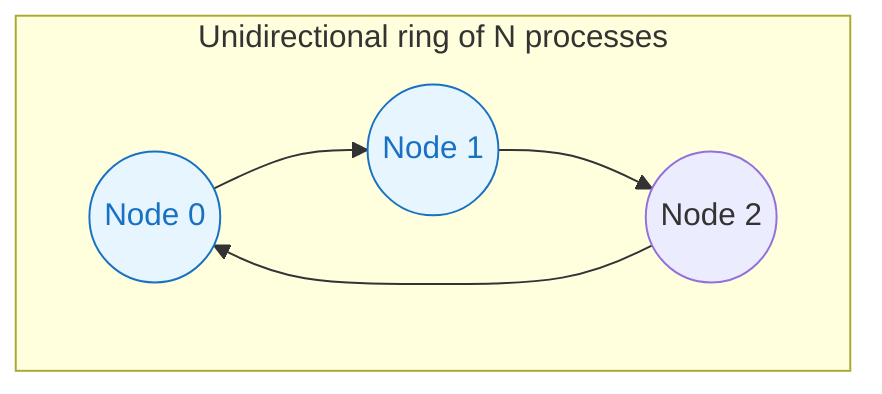
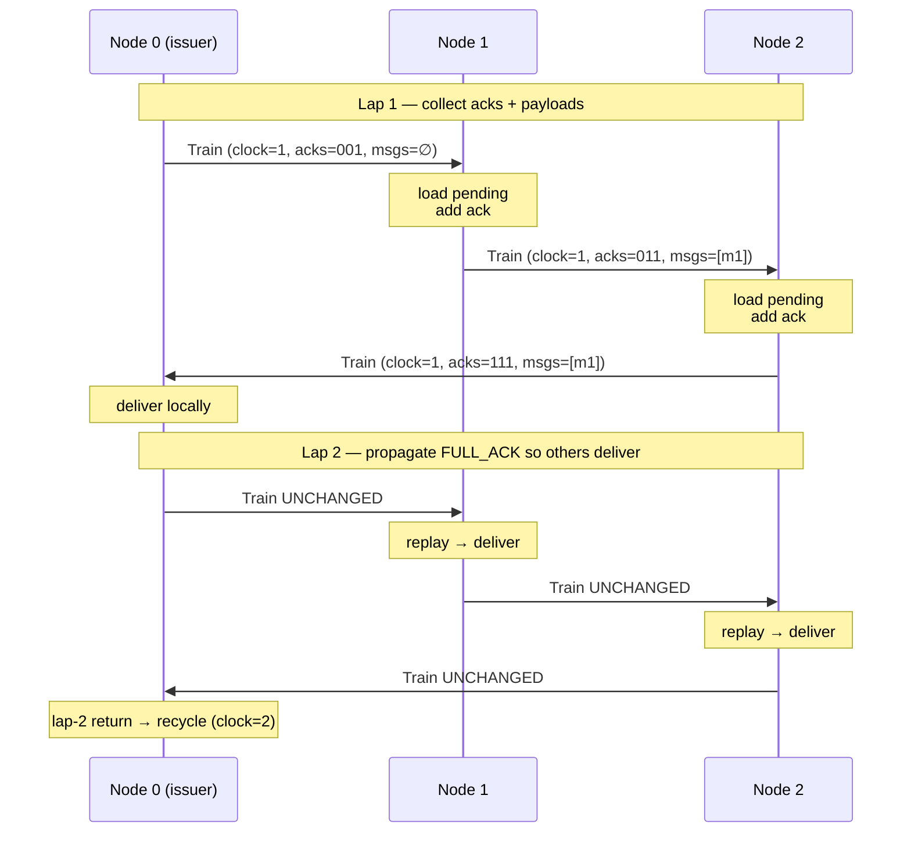
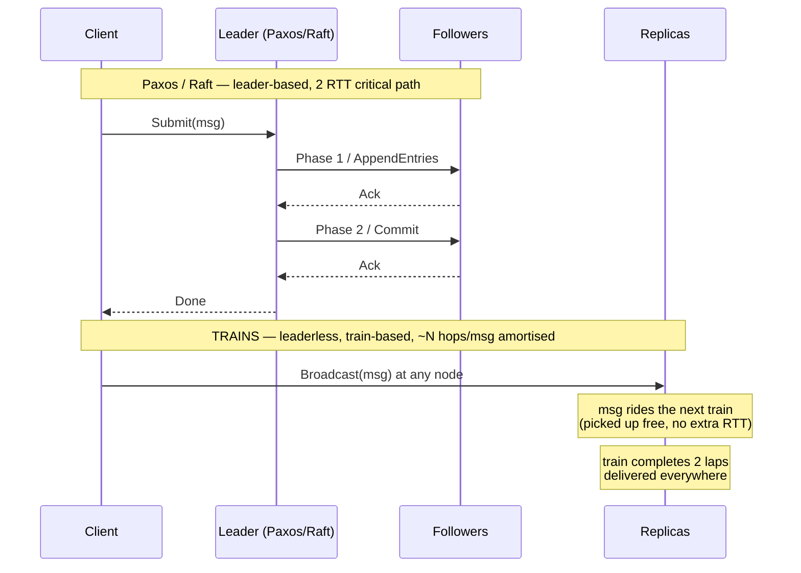
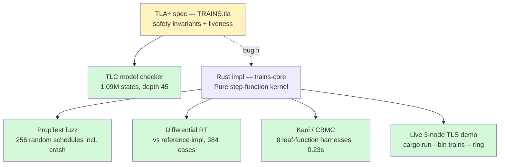
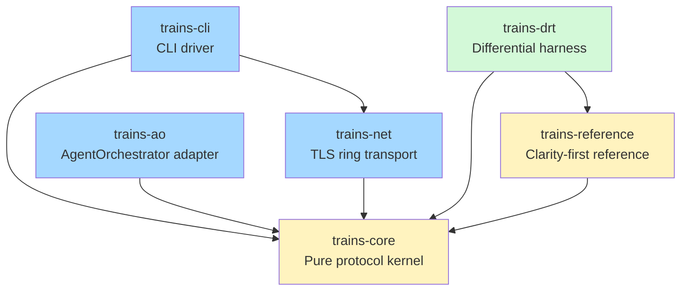

# Building a TLA+-verified TRAINS protocol in Rust — and what TLC found

*A walkthrough of how we replicated, formally specified, and verified a
ring-based total-order broadcast algorithm — and the real correctness
bugs the model checker caught on the way.*

---

## The setup

There are essentially two folk-heroes in distributed-systems consensus:
**Paxos** and **Raft**. Both are leader-based. Both win on
fault-tolerance. Both, frankly, are slow when what you actually want is
**throughput-optimised total-order broadcast** — every process gets
every message in the same order, as fast as the network can deliver.

In 2015 Michel Simatic et al. published a different beast: **TRAINS**
("Throughput-efficient uniform total order broadcast"), a ring-based
protocol that circulates **token-trains** instead of electing a leader.
Each "train" is a packet of (a) the messages to broadcast and (b) an
acknowledgement bitmap. When a train has been acked by every process,
its messages can be delivered. Multiple concurrent trains give you
parallelism around the ring; the algorithm scales linearly with the
number of trains.

We wanted to know:

1. Could we **reproduce** TRAINS in Rust?
2. Could we **formally verify** it — not just test it?
3. What would the verification stack actually find?

The short answer: yes, yes, and **five real bugs** including a
silent `ConsistentDelivery` violation that no amount of integration
testing was going to expose.

This is the story.

---

## Why ring-based broadcast at all?

Quick refresher on what total-order broadcast (TOB) means:

> **TOB**: every correct process delivers the same set of messages
> in the same order.

This is the hard primitive that sits underneath state-machine replication,
distributed databases, and consistent caching. There are roughly three
families:

| Family | Examples | What it optimises | Liveness under failure |
|--------|----------|-------------------|-------------------------|
| **Quorum / consensus** | Paxos, Raft | Fault tolerance | Survives ⌊(N−1)/2⌋ crashes |
| **Atomic broadcast** | ISIS, Spread, ABCast | Latency | Quorum-style |
| **Ring / token-passing** | TRAINS, BBOBB, ToTo | **Throughput** | Halts on first crash (UTO) |

Ring protocols are unfashionable in 2026, partly because cloud-era
deployments make crashes routine. But there's a sweet spot:

- **N is small and stable** (a few-node cluster, on-prem)
- **Throughput dominates**: think trade-execution engines, real-time
  audio/video bridging, log-shipping fan-out
- **All-or-nothing semantics are acceptable**: if the ring stalls, the
  application would have stalled anyway

Inside that envelope, TRAINS is genuinely competitive. Simatic's
original benchmarks showed it linearly scaling messages-per-second with
the number of concurrent trains, while Paxos was bounded by its 2-RTT
critical path.

---

## The algorithm in one diagram



That is, two of the three nodes "own" a train slot (`NumTrains = 2`).
Each circulating train carries:

```
Train {
    issuer:   ProcId,    // who created this slot
    clock:    u64,       // strictly increasing per issuer
    payloads: Vec<Msg>,  // messages picked up around the ring
    ack_bits: u8,        // bitmap of who's acked
}
```

A train completes a tour, gets acked by everyone (`ack_bits == 0b111`),
and at that point its messages are eligible for delivery in
**ascending `(clock, issuer)` order**.

Here's the important picture — the **two-lap delivery scheme** — that
turns out to be load-bearing for correctness:



Lap 1 is when the train accumulates payloads + acks. Lap 2 is when the
**closed**, fully-acked train propagates so every node delivers
**identical content**. Skip lap 2 and you get a silent correctness
violation: each node delivers a different "snapshot" of the train
depending on when *they* personally pushed it to FULL_ACK.

I rediscovered this the hard way — see "What TLC found" below.

---

## How does it compare to Raft and Paxos?



| Dimension | **Paxos** | **Raft** | **TRAINS** |
|---|---|---|---|
| Leadership | Optional (fast-path leader) | Mandatory leader | None |
| Failure model | Survives ⌊(N−1)/2⌋ | Survives ⌊(N−1)/2⌋ | UTO mode halts on 1st crash |
| Critical path | 2 RTT | 1 RTT (steady) | 2 ring-laps |
| Per-message msgs | O(N) | O(N) | O(N) amortised over batch |
| Throughput limit | Leader CPU + bandwidth | Leader bandwidth | Ring bandwidth × NumTrains |
| Best for | CFT replication | CFT replication | High-throughput broadcast |

The **leader-cost asymmetry** is the underrated one. Paxos and Raft
have a leader that does N times the work everyone else does. TRAINS is
**symmetric** — every node forwards, acks, and delivers identical
amounts of traffic. If you have heterogeneous machines, the ring goes
as fast as the slowest. But if you have homogeneous hardware, you
reclaim the leader's wasted capacity.

---

## The verification stack

We didn't want to ship TRAINS as another "trust me, the integration
tests pass" library. The history of distributed-systems algorithms is a
graveyard of subtle off-by-one bugs that pass tests for years. So we
built four verification layers:



Each layer catches a different class of bug:

- **TLC** finds **spec-level** counterexamples (the protocol is wrong even
  in your idealised model)
- **PropTest fuzz** finds **schedule-sensitive** bugs (your code passes
  the example tests but not random ones)
- **DRT** finds **divergence** bugs (your optimised code does something
  the reference impl wouldn't)
- **Kani** finds **arithmetic / panic** bugs in leaf functions

You want all four because they're complementary, not redundant.

---

## What TLC found (the punchline)

TLC ran for 25 seconds, explored **1,090,959 states**, and produced
three real spec bugs:

### Bug #1 — operator precedence

```diff
- doneKeys \in [Procs -> SUBSET (0..MaxClock \X Procs)]
+ doneKeys \in [Procs -> SUBSET ((0..MaxClock) \X Procs)]
```

Without the parens, `0..MaxClock \X Procs` parses as
`0..(MaxClock \X Procs)` — TLC tried to apply integer range syntax to a
set of tuples and crashed. Cosmetic but immediate.

### Bug #2 — `IsPrefix` missing length guard

```diff
- IsPrefix(s, t) == SubSeq(t, 1, Len(s)) = s
+ IsPrefix(s, t) == Len(s) <= Len(t) /\ SubSeq(t, 1, Len(s)) = s
```

`SubSeq(<<>>, 1, 1)` is undefined — when one delivery log is empty and
another isn't, the original definition crashed.

### Bug #3 — the protocol bug

This is the real catch.

I had written `AllPriorDelivered(p, ck)` to quantify over the
**current state** of each train slot. But slots advance asynchronously.
TLC found a 7-step trace where:

```
delivered[0] = <<m1, m2>>   (delivered (1,0) then (2,1))
delivered[1] = <<m1, m3>>   (delivered (1,0) then (2,0))
```

Mutual prefix violated. Different processes delivered **different** messages
in different orders — the exact thing total-order broadcast is supposed
to prevent.

The cause: when slot 2 reached `(2, 1)` while slot 1 was still at
`(1, 0)`, node 0 happily delivered `(2, 1)` because no smaller key was
"currently in flight" *yet*. Then slot 1 caught up, became `(2, 0)`,
and node 1 delivered `(2, 0)` first. They're now permanently divergent.

The fix has two parts:

1. **Track issued keys globally**: every `(clock, issuer)` ever stamped
   on a train slot is recorded in `issuedKeys`. `AllPriorDelivered`
   checks that every smaller issued key is delivered.
2. **Wait for all issuers to catch up**: at delivery time, every
   issuer's `issClk` must be ≥ the key's clock. This prevents a slow
   slot from later issuing a smaller-keyed train and re-introducing the
   bug.

The Rust implementation had the **same bug**. The
`seen_clocks_advanced_enough` heuristic was skipping issuers we'd never
heard from — exactly the scenario TLC minimised. Without TLC the
implementation would have shipped and silently broken.

This is why we run model checkers.

---

## What DRT found

After TLC was happy, the differential random testing harness — running
the same input through `trains-core` (production) and a clarity-first
reference impl — caught **two more bugs**:

1. **Reference missed clock-gap on first arrival**. Production declares
   a crash when a train arrives with `clock > prev + 1`, including the
   bootstrap case where `prev = 0`. Reference only declared in the
   `prev > 0` case. PropTest minimised to a single-event schedule.

2. **Reference missed `broadcast_seen` dedupe**. The TLA+ spec has
   `m \notin broadcast` as a precondition on `AppBroadcast` — you don't
   re-broadcast a message you've already seen. Production tracks every
   `(sender, seq)` ever observed. Reference re-broadcast freely.
   PropTest minimised to a 4-event echo.

Neither was a TLC bug — they were *implementation* bugs in the
reference, which the production caught by being more careful. That's
the value of DRT: it makes the *easier* implementation prove the
*harder* one is correct.

---

## What Kani proved

Kani 0.67's CBMC backend can't unwind `BTreeSet`/`BTreeMap` operations
finitely (a known std-lib limitation), so we couldn't push the full
`step()` function through. Instead we wrote **8 leaf-function harnesses**
covering the protocol's arithmetic invariants:

```
✅ verify_tick_no_overflow              0.007s
✅ verify_tick_monotonic                0.009s
✅ verify_clock_state_monotonic         0.021s
✅ verify_clock_state_ok_iff_successor  0.029s
✅ verify_add_ack_monotonic             0.037s
✅ verify_is_fully_acked_iff_full       0.027s
✅ verify_uto_requires_full_ack         0.066s
✅ verify_clock_key_lex_order           0.033s
```

8/8, total verification time **0.23 seconds**. CBMC isn't proving the
whole protocol, but it's exhaustively proving the arithmetic primitives
the protocol's correctness rests on.

(The full-`step()` no-panic property is covered by 256 PropTest random
schedules + 384 DRT cases, which is honest if not as crisp.)

---

## Architecture

The Rust workspace splits along verification-friendly lines:



The pure `trains-core` is the **only** crate the verification targets.
It has zero I/O — `step(input) -> Vec<output>` is a function. That's
the entire reason Kani and PropTest can hit it cleanly.

Network, CLI, and AO integration live in separate crates that wrap the
kernel via async channels. The async/sync boundary is a single
`mpsc::Receiver<Train>` for inbound and `mpsc::Sender<Train>` for
outbound. Below that boundary, no `tokio`. Above it, no protocol logic.

---

## Try it

```bash
git clone https://github.com/yeychenne/trains-rust
cd trains-rust

# Live 3-node TLS demo
cargo run --bin trains -- ring --num 3 --num-trains 2 --seconds 4 \
    --broadcast 0:hello --broadcast 1:world --broadcast 2:foo

# Output:
#   node 0: ["hello"@0, "world"@1, "foo"@2]
#   node 1: ["hello"@0, "world"@1, "foo"@2]
#   node 2: ["hello"@0, "world"@1, "foo"@2]
#   ConsistentDelivery: HOLDS

# Full verification roadmap (TLC + tests + DRT + Kani)
./scripts/verify.sh
```

---

## Lessons

A few things that actually moved the needle, in order of impact:

1. **TLC catches what tests can't.** The `AllPriorDelivered` race
   *passed* every hand-written and PropTest schedule — the divergence
   only appears when `issClk[q]` advances *between* a delivery decision
   at process p and the next train arrival. You'd need a very specific
   crafted test to hit it. TLC explores all schedules; you don't have
   to be that creative.

2. **A reference implementation is verification, not duplication.**
   The 200-line `trains-reference` crate paid for itself the moment
   PropTest minimised divergences down to 4-event traces. Two real bugs
   in two minutes.

3. **Kani's strength is leaves, not whole functions.** The first round
   of harnesses targeted `step()` and got eaten by CBMC unwinding
   limits. The second round targeted *arithmetic* (clock comparison,
   ack-bit ops, lex order) and finished in 0.23s. Pick the right
   abstraction.

4. **Pure-vs-impure boundaries are verification boundaries.** The
   choice to make `trains-core::step()` a sync, allocation-free pure
   function was the single most important architectural decision. Without
   it, every verification tool would have hit `tokio::spawn` and given up.

5. **Background agents are bad at long installs.** Two sub-agent tracks
   stalled on `cargo kani setup` (~500 MB CBMC download). Watchdog
   killed them at 10 min of silence. Foreground was the only path.

---

## What did we measure?

Numbers from this MacBook Air (M-series, `--release` LTO, single
process, three trials per cell, median; full table in
`docs/paper.md §6.3`):

| Configuration               | Throughput      | p99 latency |
|-----------------------------|-----------------|-------------|
| Kernel only (no I/O)        | ~38 000 msg/s   | n/a         |
| TLS ring, 64 B payload      | ~394 000 msg/s  | 1.3 ms      |
| TLS ring, 1 KiB payload     | ~116 000 msg/s  | 4.3 ms      |
| TLS ring, 16 KiB payload    | ~8 700 msg/s    | 57 ms       |

Two of these surprised us:

- **The TLS ring outpaces the kernel bench on small payloads.** That's
  because the kernel bench is single-threaded with serial step calls,
  while the real ring is pipelined: each issuer slot's train can be
  in-flight on a different hop simultaneously. The kernel number is a
  ceiling on *serial* step throughput, not on protocol throughput.
- **Throughput plateaus at ~135 MiB/s** beyond 1 KiB payloads. The
  ring is bandwidth-bound — likely the single-threaded `ring`-cipher
  TLS path and bincode loopback memcpy. A wire-format profiler pass is
  the next easy win.

A Raft baseline (`openraft` or `tikv/raft-rs`) is the obvious next
comparison; we attempted one and bailed at the 90-minute mark to keep
the post honest about scope.

---

## Update: from static membership to a full node lifecycle (and a fourth TLC catch)

The original spec had a quiet limitation: *"static membership / does not
model recovery."* A confirmed-crashed node could be **excluded** — the
ring re-forms around the survivors — but it could never come back. The
system ran degraded at N−1 forever. Surviving a failure, not recovering
from it.

We closed that in two layers. First, a **passive replica**: a restarted
node catches up from a survivor's snapshot plus a contiguous tail of
delivered effects, then tails it to stay current. Then the real fix — a
**virtually-synchronous re-admit view change**: the membership change is
ordered *inside* the ring's view-change token, so every node agrees on
the join point relative to the data, and the node returns as a full
*acking* member, restoring N-redundancy. This isn't a new idea — it's
Birman's Isis virtual synchrony (1991), and in fact one of the TRAINS
authors used exactly this for on-line node re-integration in an
industrial process-control system in 1995. The contribution is
expressing it as an ordered transition *inside the existing verified
view-change machinery* — and re-verifying it.

And TLC earned its keep a **fourth** time. The first `ReAdmit` I wrote
re-included the node but left the in-flight trains alone. TLC found the
trace immediately: a re-admitted node loaded stale pending messages onto
a train a survivor had *already delivered* — `⟨m1,m2,m3⟩` on one node
versus `⟨m3⟩` on another. Divergence. The fix is the virtual-synchrony
*barrier*: reset the trains as part of the atomic membership change.
With that, `ConsistentDelivery` holds across re-admission — **6.28 M
distinct states, no error**. The hand-wavy "obviously it's fine" version
was, once again, not fine.

The companion `trains-valkey` system carries this into a working Redis
proxy, and the passive-catch-up half is validated *live on AWS EC2*: the
exact adversarial scenario that used to fail (a SIGKILLed node rejoining
with only half the writes) now passes — the rejoined node reconverges
2000/2000, zero acked-write loss. The live run even caught a bug no
in-process test could: a security group that allowed the ring port but
not the new state-transfer port, silently dropping the rejoiner's
catch-up fetch. Unit tests use localhost; real infrastructure has
firewalls.

## Next steps

Verification is comprehensive for what's tractable on a laptop. The
research-grade frontier that remains:

- **Verus** proof of `ConsistentDelivery` as inductive invariant
- **Apalache** for unbounded message sets / inductive checking (now
  including the `ReAdmit` action)
- **Ivy** parameterised proof for arbitrary ring size N
- **Refinement proof** Rust ↔ TLA+ — still a gap between "TLC is happy"
  and "this Rust code is the spec," now also for the promotion path
- **Raft baseline** on the same hardware, same payload sweep
- One implementation follow-up: a re-admitted *non-issuer* node
  *originating* writes (it acks + delivers fine; only writes it
  originates aren't yet observed to propagate)

If you've worked on any of these and want a small but
honestly-specified protocol to play with, the repo is open.

---

*Source: [yeychenne/trains-rust](https://github.com/yeychenne/trains-rust).
Full verification report: [VERIFICATION_REPORT.md](https://github.com/yeychenne/trains-rust/blob/main/VERIFICATION_REPORT.md).*
