# TRAINS — Architecture and Algorithm Diagrams

This page is the visual companion to [paper.md](paper.md) and [blog.md](blog.md).

## At a glance

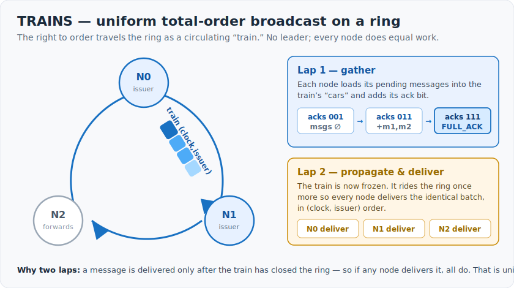

The whole protocol in one picture: a leaderless ring, a **train** circulating
twice — **lap 1** gathers each node's messages and acks until the train is
`FULL_ACK`, **lap 2** propagates the frozen train so every node delivers the
identical batch in `(clock, issuer)` order. Delivering only after the train
closes the ring is what makes the order *uniform*. The detailed Mermaid diagrams
below (which render natively on GitHub) break down each piece.

---

## 1. Ring topology

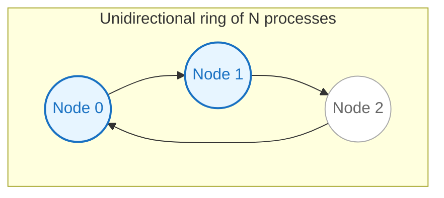

With `RING_SIZE = 3` and `NumTrains = 2`, two processes are *issuers*
(blue) — they own a train slot. The third forwards and acks but never
issues.

---

## 2. Train data flow — one full cycle

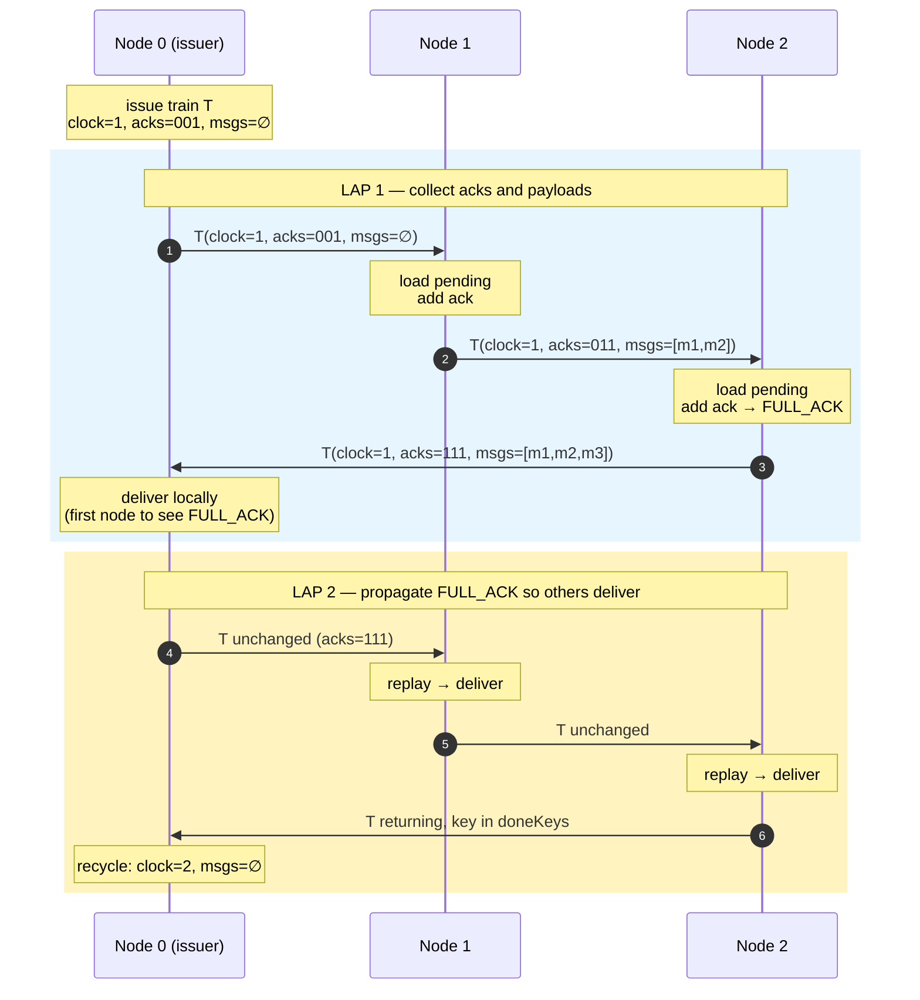

The two-lap structure is load-bearing for `ConsistentDelivery`.
Lap 1 builds the train; Lap 2 distributes the *frozen* version of it
so every node delivers identical content.

---

## 3. State machine — one TrainsNode

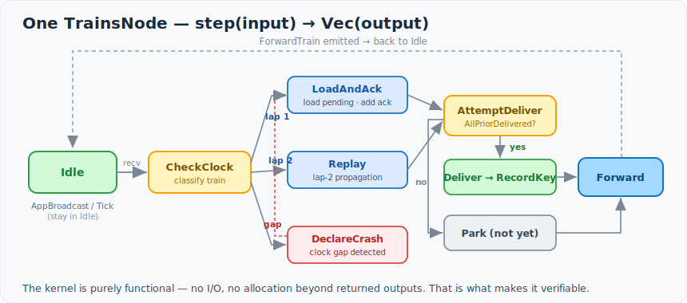

*The Mermaid source below renders the same structure natively on GitHub.*

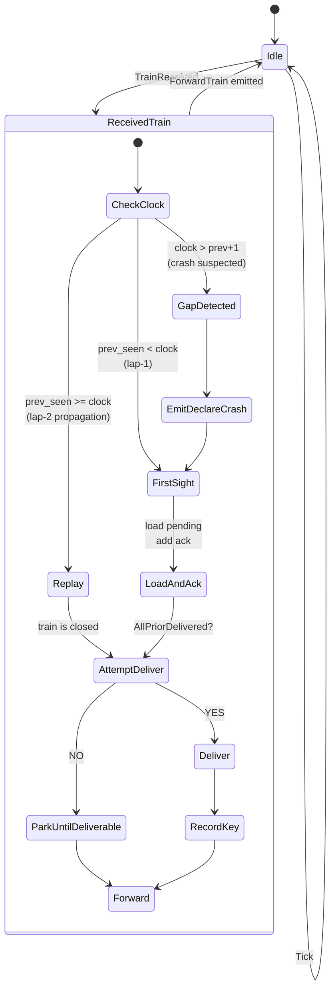

Each `step(input) → Vec<output>` call traces a path through this
machine. The kernel is purely functional — no I/O, no allocation
beyond returned outputs. This is what makes the verification stack
tractable.

---

## 4. Multiple concurrent trains (NumTrains = 2)

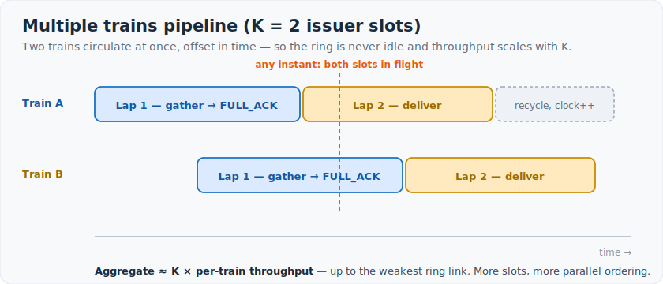

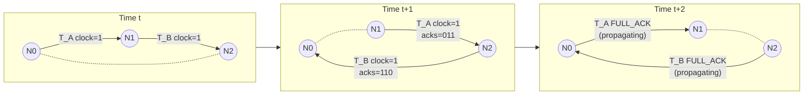

Two trains pipeline around the ring. With `NumTrains = K` the
aggregate throughput scales as `K × (per-train throughput)`, up to the
weakest link's bandwidth.

---

## 5. Verification stack

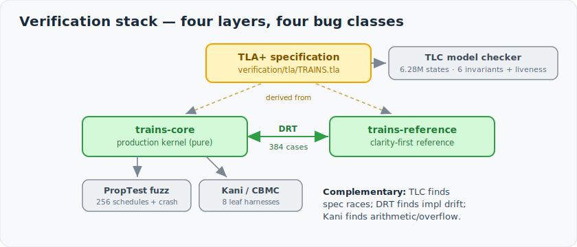

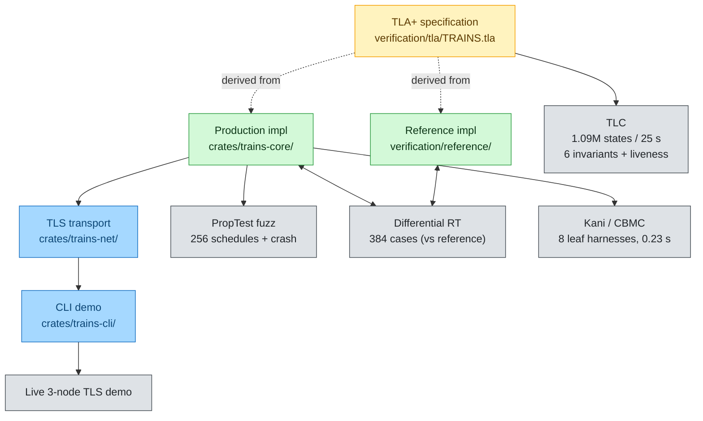

Each layer catches a different bug class:

| Layer | Catches |
|------|------|
| TLC | Spec-level race conditions, bad invariants, type errors |
| PropTest fuzz | Schedule-sensitive bugs the example tests miss |
| DRT | Production vs reference divergences (incl. dedupe / boundary cases) |
| Kani | Arithmetic / panic / overflow on leaf functions |

All four are complementary — a bug in one is rarely caught by another.

---

## 6. Workspace architecture

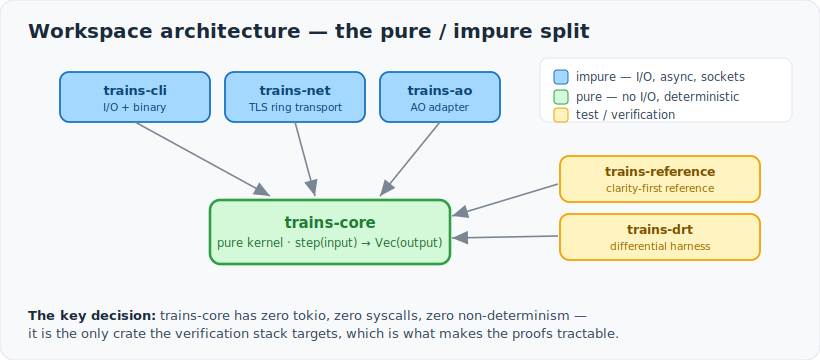

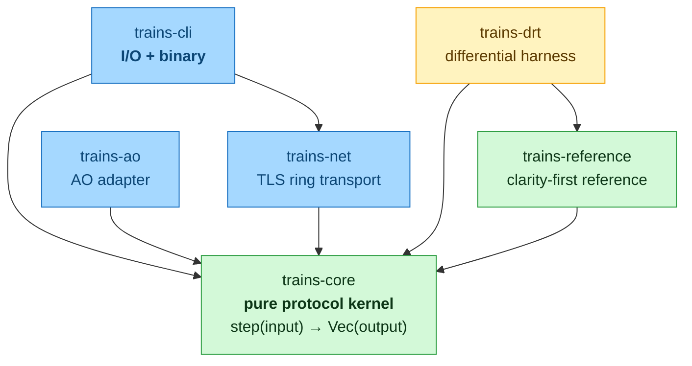

The pure / impure split is the most important architectural decision.
`trains-core` has zero `tokio`, zero syscalls, zero non-deterministic
state. It is the *only* crate the verification stack targets.

---

## 7. Comparison: Raft vs TRAINS critical path

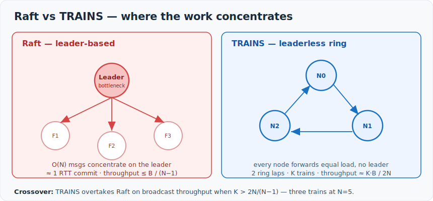

*The two Mermaid sequence diagrams below show the per-message critical path in detail.*

### Raft (steady-state replication)

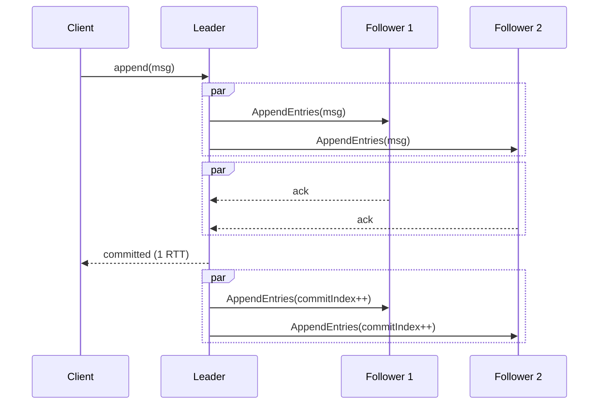

- Leader is the bottleneck.
- Per-decision: O(N) messages, ≈ 1 RTT critical path.
- Survives ⌊(N−1)/2⌋ crashes with automatic recovery.

### TRAINS (UTO mode)

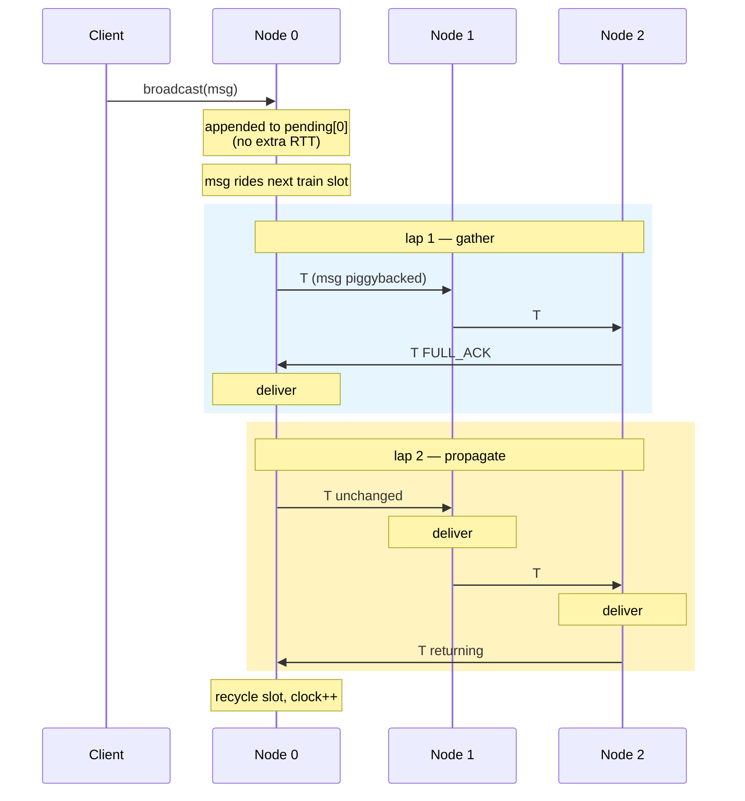

- No leader; every node forwards equal load.
- Per-message: amortised O(N) across batch; 2 ring laps until delivery.
- UTO mode halts on **any** crash (the strongest safety mode).

---

## 8. The bug TLC found

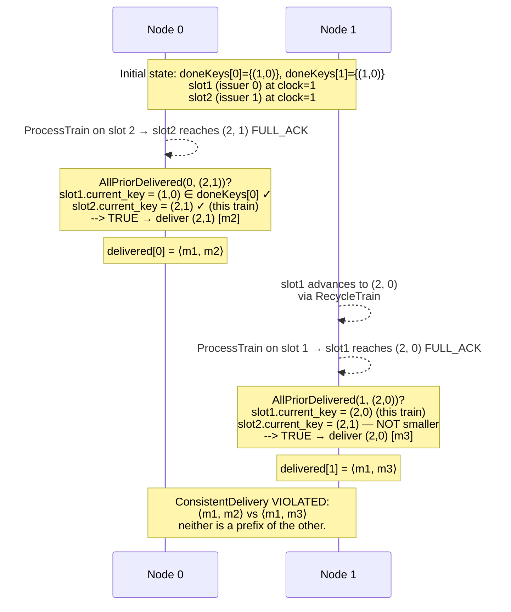

The fix introduces a global `issuedKeys` set + an `Issuers`
clock-catchup precondition so the unsafe interleaving is no longer
enabled. See `paper.md` §4.4.

---

## 9. Throughput model — TRAINS vs Raft (qualitative)

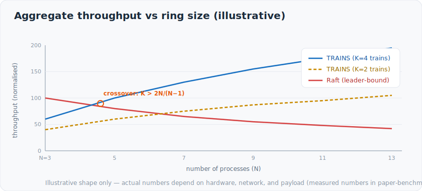

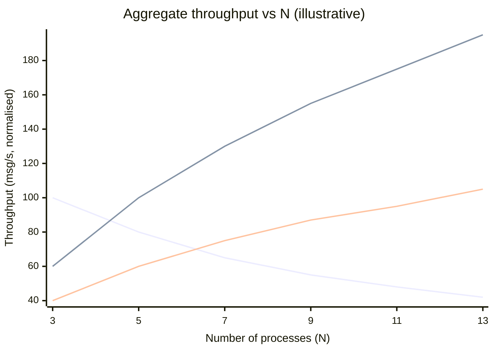

*Illustrative — actual numbers depend on hardware, network, and message
size. The qualitative shape is the point: TRAINS scales with the number
of concurrent trains, Raft is bottlenecked at the leader.*

The crossover between Raft and TRAINS lies at `K > 2N / (N − 1)`
(see paper.md §6.2). For N = 5, three or more concurrent trains beat
Raft on broadcast throughput.

---

## 10. Group membership — exclude, catch up, re-admit

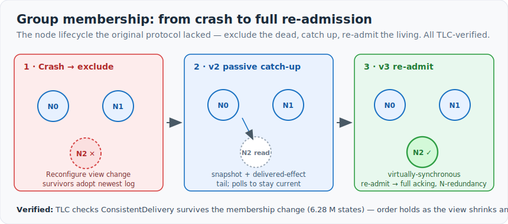

The node lifecycle the original protocol lacked. A confirmed crash triggers a
`Reconfigure` view change (the survivors adopt the most-advanced log and run at
N−1); the recovered node first rejoins as a **passive read-replica (v2)** that
catches up from a survivor's snapshot + delivered-effect tail; then a
**virtually-synchronous re-admit view change (v3)** returns it as a full acking
member, restoring N-redundancy. TLC checks `ConsistentDelivery` survives the
membership change (6.28 M states) — order holds as the view both shrinks and
grows. See [`WHITEPAPER-rejoin-and-readmission-2026-06-16.md`](WHITEPAPER-rejoin-and-readmission-2026-06-16.md)
and `paper.md` §5.2.
