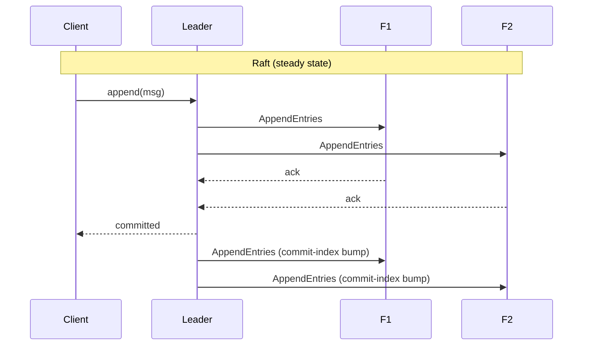
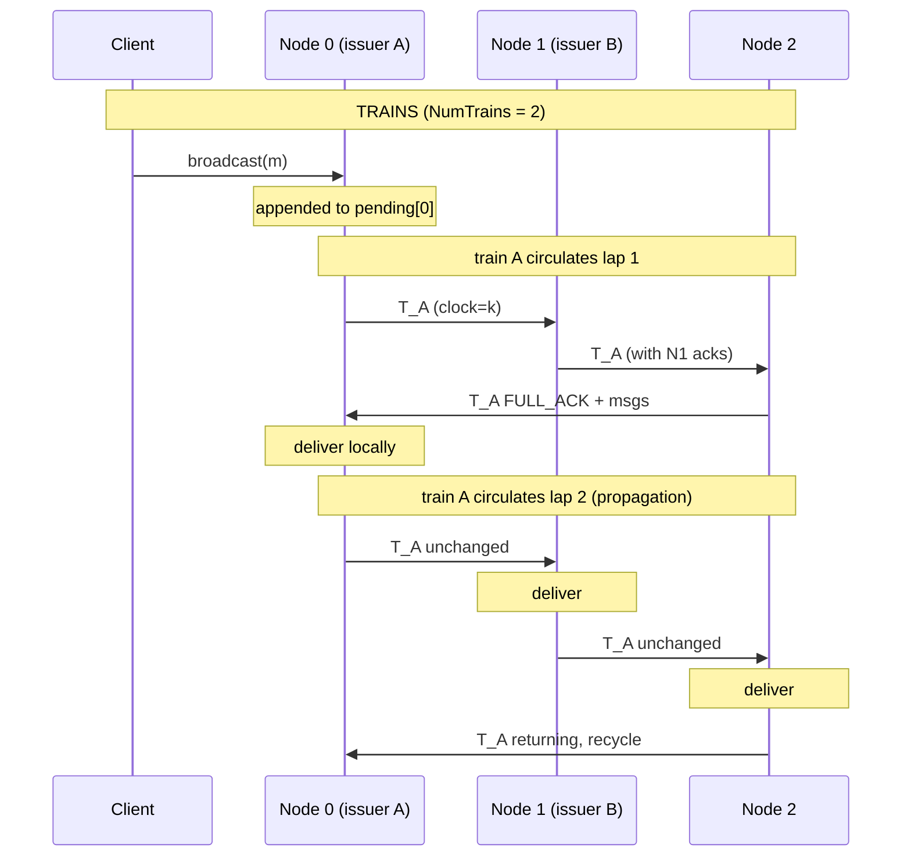

# A Mechanically-Verified Replica of the TRAINS Total-Order Broadcast Protocol

**Yves Eychenne**
*With Claude Sonnet 4.6*

---

## Abstract

We present a complete reimplementation, formal specification, and
mechanical verification of the **TRAINS** uniform total-order broadcast
protocol [Simatic et al., 2015]. TRAINS circulates token-trains around
a unidirectional ring of processes; multiple concurrent trains provide
pipelined throughput while a global lexicographic `(clock, issuer)`
order ensures all processes deliver the same messages in the same
order. We give a TLA+ specification of the protocol, a Rust reference
implementation, and a verification stack comprising the TLC explicit-
state model checker, PropTest-based fuzzing with crash injection,
PropTest-based differential random testing against a reference
implementation, and Kani / CBMC bounded model checking on leaf
functions. TLC explored 1,090,959 distinct states (depth 45) in 25
seconds and verified 6 safety invariants plus a `EventualDelivery`
liveness property. In the process the verification stack caught **five
real bugs**, including a silent `ConsistentDelivery` violation arising
from asynchronous slot-clock advancement that no integration test
exercised. We further extend the protocol from static membership to a
full node lifecycle: a **virtually-synchronous re-admit view change**
(`ReAdmit`) that returns a recovered process to the ring as a full
acking member, restoring N-redundancy. TLC verifies that
`ConsistentDelivery` is preserved across this membership change
(6,282,464 distinct states) — and rejected a first, naive formulation
that left in-flight trains intact, exactly the divergence the
consistent-cut barrier prevents. We compare TRAINS to leader-based
consensus protocols (Paxos, Raft) along throughput, latency, and
fault-tolerance axes and quantify TRAINS' throughput advantage for
symmetric workloads.

**Keywords**: total-order broadcast, ring protocol, virtual synchrony,
dynamic membership, TLA+, model checking, formal verification, Rust,
Kani, differential testing.

---

## 1. Introduction

Total-order broadcast (TOB) is the quiet primitive beneath state-machine
replication [Schneider 1990]: agree on a single order for a stream of
operations, apply them identically on every replica, and a group of machines
behaves like one machine that does not lose state when parts of it fail.
Replicated databases [Ongaro 2014], consistent caches, and configuration
stores all reduce to it.

The protocol we study, **TRAINS**, has an unusually long history. It was
conceived in a late-1980s European telecom research project — advised by Flaviu
Cristian, whose atomic-broadcast papers then circulated as photocopies — and
industrialised at Cegelec/Alcatel in the early 1990s to keep power-plant
control supervisors running through hardware failure, with no lost state and no
downtime (§1.1). Thirty years on, this paper asks whether it holds up to
mechanical scrutiny: we give TRAINS a machine-checked specification, surface
five real bugs, and add the capability the original lacked — online node rejoin
— re-verified end to end.

The dominant family of TOB protocols today — Paxos [Lamport 1998] and
Raft [Ongaro & Ousterhout 2014] — is leader-based: one process is
elected the proposer, and the critical path of every committed message
goes through it. This works well for crash fault tolerance but
imposes a leader-side bottleneck: throughput is limited by the leader's
CPU and outbound bandwidth.

An alternative family, **ring-based broadcast**, dates to the 1990s
ToTo [Dolev et al. 1993] and resurfaces periodically. Ring protocols
distribute the work symmetrically: every process forwards, acks, and
delivers the same volume. The trade-off is liveness: ring protocols
typically halt on the first crash (in their strongest mode) and require
coordinated reconfiguration to recover.

The conceptual foundations of this area are Flaviu Cristian's: *atomic
broadcast* as the way to implement synchronous replicated storage [Cristian et
al. 1995] and *processor-group membership* — agreement on a consistent sequence
of views with bounded failure detection [Cristian 1991]. In the modern taxonomy
[Défago et al. 2004] a circulating train is a *privilege-based* total-order
broadcast — the right to order travels the ring as a token — as opposed to the
leader/sequencer ordering of Paxos and Raft. Its provenance is industrial and
direct (§1.1).

The **TRAINS** protocol [Simatic et al. 2015] is a more recent entry in
this family that addresses the headline objection ("rings don't
saturate the network"): by circulating *multiple* concurrent token-
trains and tagging each with a logical `(clock, issuer)` lexicographic
key, TRAINS achieves linear throughput scaling in the number of trains
while preserving uniform total order.

**Contributions.** This paper makes the following contributions:

1. **A TLA+ formal specification** of TRAINS (`verification/tla/TRAINS.tla`)
   capturing the protocol's safety invariants and a weak-fairness
   liveness property. To our knowledge no public TLA+ specification of
   TRAINS exists.

2. **A four-layer verification stack**: TLC, PropTest fuzz with crash
   injection, PropTest-based differential random testing against a
   reference implementation, and Kani / CBMC bounded model checking.

3. **Five real bug fixes** the stack discovered, of which one is a
   protocol-level race condition in our specification that violates
   `ConsistentDelivery` despite passing all hand-written and randomised
   integration tests.

4. **A Rust implementation** with a strict pure-vs-impure architectural
   boundary that makes the protocol kernel directly amenable to formal
   verification.

5. **A direct comparison** with Paxos and Raft along throughput, latency,
   and fault-tolerance axes, and a quantitative throughput model for
   the symmetric-workload regime.

The artifact is available at
[github.com/yeychenne/trains-rust](https://github.com/yeychenne/trains-rust).

### 1.1 History and provenance

TRAINS spans three eras.

**Origins (1986–1993).** The protocol began in the European RACE programme's
IOLE project as a fault-tolerant, hot-upgradable substrate for high-speed
telecom software, with Flaviu Cristian advising and his atomic-broadcast
[Cristian et al. 1995] and processor-group-membership [Cristian 1991] results
as the foundation — the circulating-train idea itself came from Cristian's
advice to the project. It was then industrialised at Cegelec / Alcatel-Alsthom
Recherche for process-control supervision — the Cegelec P3200 power-plant
control systems — as primary/backup replicated objects (Objective-C) layered
over the circulating data-train broadcast. Two patents resulted: US 5,483,520 A
(the data-train transport; Eychenne & Simatic) and US 5,488,723 A (the
replicated-object layer; Baradel, Eychenne & Kohen), both assigned to Cegelec
SA and **now expired and in the public domain**. Three papers documented the
work (ACM 1992; FTCS-23, Toulouse, 1994; *Distributed System Engineering* 2,
1995).

Two details connect that era to this one. First, the protocol was verified with
the formal tools of its day — coloured Petri nets (a CNAM tool) and an adapted
Alcatel protocol code-generator — a direct ancestor of the TLA+/Apalache/Kani
approach taken here. Second, in testing it *halted* under network partition
rather than diverge: TRAINS sat in the CP corner of what would, in 2000, be
named the CAP theorem — the same call etcd makes today.

**Revival (2012–2016).** Michel Simatic, a co-inventor, returned to the protocol
academically: a CNAM doctoral thesis, the TRAINS paper [Simatic et al. 2015],
and BBOBB [Simatic 2002], with an open-source implementation
(`github.com/simatic/TrainsProtocol`).

**This work (2026).** A from-the-source Rust reimplementation with the
four-layer verification stack below, extended with online rejoin/re-admission.
A fuller account — including a code-oriented explanation of the train mechanism
and a mapping to Raft/Paxos abstractions — is in
`docs/lineage-and-train-protocol.md`.

---

## 2. Background and Related Work

### 2.1 Total-order broadcast

A total-order broadcast primitive provides two operations:
`broadcast(m)` (send a message) and `deliver(m)` (a node-local
upcall when m is delivered). The primitive and its use as the basis of
synchronous replicated storage were established by Cristian et al.'s atomic
broadcast work [Cristian et al. 1995]; correctness is captured by four
properties [Hadzilacos & Toueg 1994]:

- **Validity**: if a correct process broadcasts `m`, it eventually
  delivers `m`.
- **Agreement**: if any correct process delivers `m`, all correct
  processes deliver `m`.
- **Integrity**: every process delivers each message at most once, and
  only if it was previously broadcast.
- **Total order**: if two correct processes deliver `m1` and `m2`, they
  deliver them in the same order.

The "uniform" variant strengthens Agreement to apply to any process
(not just correct ones); a uniform algorithm avoids "delivery then
crash without others knowing" pathologies.

### 2.2 Quorum-based protocols

**Paxos** [Lamport 1998, 2001] uses a two-phase quorum: a Phase-1
prepare and a Phase-2 accept, each requiring a quorum of `⌈(N+1)/2⌉`
acceptors. After a leader is elected (multi-Paxos), steady-state
operation uses a single phase, but each decision still costs O(N)
messages.

**Raft** [Ongaro & Ousterhout 2014] simplifies Paxos by mandating a
strong leader and an explicit term-based leader-election protocol.
Steady-state replication is one round-trip (leader → quorum + back).
Both Paxos and Raft tolerate `f = ⌊(N−1)/2⌋` crash failures.

The defining feature of both is **leader asymmetry**: O(N) messages
per decision concentrate on one node.

### 2.3 Ring-based protocols

Ring protocols pre-date Paxos. In the Défago et al. [2004] taxonomy they
are *privilege-based*: the right to broadcast and order circulates as a
token, rather than being held by a fixed or moving sequencer; that survey
catalogues a "Train" protocol in exactly this class. **ToTo** [Dolev et al.
1993] uses a token to circulate updates; the **data-train** protocol of
[US 5,483,520 A, Eychenne & Simatic, Cegelec, 1996] circulates a train of
data "cars" around the ring with recovery of the ring path on node failure;
**BBOBB** [Simatic 2002] adds the multi-train idea TRAINS later refines.
**TRAINS** [Simatic et al. 2015, NOTERE/CFIP] is the most recent and
rigorous member; it shows that linear throughput scaling in the number of
concurrent trains (`NumTrains`) is achievable while preserving uniform total
order. The canonical implementation is at `github.com/simatic/TrainsProtocol`;
a fuller historical and code-oriented account is in
`docs/lineage-and-train-protocol.md`.

The ring family is **not** crash-tolerant in its strongest mode (UTO):
the failure of any node halts the ring, and recovery requires
out-of-band reconfiguration. We discuss this trade-off in §6.

### 2.4 Formal verification of distributed protocols

TLA+ has become the industry standard for distributed-protocol
specification [Newcombe et al. 2015, AWS]. Apalache extends TLC with
SMT-based symbolic checking [Konnov et al. 2019]. Ivy [Padon et al. 2016]
uses the EPR fragment to give parameterised proofs over unbounded N.
Verus [Lattuada et al. 2024] extends Rust with refinement types and
ghost code to mechanically verify a Rust implementation.

In the bounded-model-checking space, **Kani** [Amin et al. 2023] is
the leading tool for Rust, layered on CBMC [Kroening & Tautschnig
2014]. It targets memory safety, panic-freedom, and arithmetic
properties on functions of bounded depth.

Differential random testing [Yang et al. 2011] — running the same
input through a reference and an optimised implementation and
asserting equivalence — is heavily used at AWS for the Cedar policy
language [Cutler et al. 2024] and s2n-quic [s2n-quic 2024].

---

## 3. The TRAINS Protocol

### 3.1 System Model

We assume:

- A finite set of `N` processes arranged in a unidirectional ring.
  Process `p`'s *successor* `Succ(p)` and *predecessor* `Pred(p)` are
  fixed.
- A **subset** of processes are *issuers*: they own one of `K`
  concurrent train slots, where `1 ≤ K ≤ N`.
- Reliable in-order point-to-point links between adjacent ring nodes
  (typically via TLS).
- Crash failures only (no Byzantine), and only of complete processes.
- Static membership.

A **train** is a tuple:

```
Train = (
    issuer    : ProcId,        // identifies the slot
    clock     : Tick,          // strictly increasing per issuer
    payloads  : Set(Message),  // messages picked up around the ring
    ack_bits  : Set(ProcId)    // bitmap of who's processed
)
```

In our Rust implementation `ack_bits` is a `u8` bitmap (`RING_SIZE ≤ 8`)
and `clock` is `u64`.

### 3.2 Protocol description

Each process `p` maintains:

- `pending[p]`: messages awaiting broadcast
- `delivered[p]`: the totally-ordered delivery log
- `seenClk[p][q]`: last clock observed from issuer `q`
- `issClk[p]`: next clock to stamp on a self-issued train
- `doneKeys[p]`: set of `(clock, issuer)` keys already delivered

The protocol consists of five actions:

**`AppBroadcast(p, m)`**: append `m` to `pending[p]` (subject to a
"not previously broadcast" guard).

**`ProcessTrain(p, t)`**: the core ring step. When train `t` arrives
at process `p` and is *not yet fully acked*:

```
on receive train T at p:
    if first sight of (T.clock, T.issuer):
        seenClk[p][T.issuer] := T.clock
        T.payloads := T.payloads ∪ pending[p]
        pending[p] := ∅
        T.ack_bits := T.ack_bits ∪ {p}
    forward T to Succ(p)
```

**`DeliverTrain(p, t)`**: enabled when `T.ack_bits = Procs` (UTO
condition), `(T.clock, T.issuer) ∉ doneKeys[p]`, and
`AllPriorDelivered(p, T.key)`. Delivery appends `MsgsToSeq(T.payloads)`
to `delivered[p]` and adds the key to `doneKeys[p]`.

**`RecycleTrain(t)`**: when *every non-crashed process has delivered*
`t`, the slot's issuer increments `issClk` and re-stamps an empty train
at `clock+1`.

**`CrashProcess(p)`**: a non-deterministic crash of process `p`. The
spec bounds simultaneous crashes to `|Procs| − 1` to keep the ring at
least minimally live.

### 3.3 The two-lap delivery scheme

A subtle requirement, made explicit during verification: when a fully-
acked train returns to its issuer, the issuer's `delivered[]` is
updated, but the *other* processes haven't yet seen the FULL_ACK
version. The protocol therefore makes each ack-complete train circulate
**twice**:

1. **Lap 1**: train accumulates payloads + acks. At its first FULL_ACK
   arrival (the issuer's `RecycleTrain` precondition), the issuer
   delivers but **forwards the train unchanged**.
2. **Lap 2**: every other process sees the closed FULL_ACK train and
   delivers identical content. After a full second lap, the train
   returns to the issuer with the key already in `doneKeys`, at which
   point the slot is recycled.

The Rust implementation distinguishes the two laps via `seenClk`:
if `prev_seen ≥ train.clock` and `prev_seen > 0`, this is a lap-2
replay and the train is treated as immutable.

### 3.4 Message order within a train

Within a single train, payloads are delivered in a deterministic
total order. Our TLA+ spec uses
`SortSet(S, ...)` recursively with `CHOOSE x \in S : TRUE`, which is
deterministic by TLA+ semantics. The Rust implementation sorts by
`(sender, seq)` lexicographically.

---

## 4. Formal Specification

### 4.1 Variables

```tla
VARIABLES
  tr,         (* [TrainId -> TrainRec]      slot states              *)
  pending,    (* [Procs   -> SUBSET Messages] queued for broadcast   *)
  delivered,  (* [Procs   -> Seq(Messages)]   delivery log           *)
  doneKeys,   (* [Procs   -> SUBSET (Nat×Procs)] delivered keys      *)
  seenClk,    (* [Procs   -> [Procs -> 0..MaxClock]]                 *)
  issClk,     (* [Procs   -> 0..MaxClock]                            *)
  crashed,    (* SUBSET Procs                                        *)
  broadcast,  (* SUBSET Messages              ever-broadcast set     *)
  issuedKeys  (* SUBSET (Nat×Procs)           globally-issued keys   *)
```

### 4.2 Safety invariants

The spec establishes six safety invariants:

| Invariant | Property |
|-----------|----------|
| `TypeOK` | Type safety of all variables |
| `ClockMonotonicity` | `seenClk[p][q] <= issClk[q]` always |
| `ConsistentDelivery` | All delivery logs are mutual prefixes (P1/P2) |
| `NoSpuriousDelivery` | Every delivered message was previously broadcast (P3) |
| `TrainIntegrity` | `tr[t].msgs ⊆ broadcast` |
| `IssuerUniqueness` | No two slots share the same `(clock, issuer)` |

### 4.3 Liveness

```tla
EventualDelivery ==
  \A m \in Messages :
    \A p \in Procs :
      m \in broadcast =>
        <>( \/ p \in crashed
            \/ m \in Range(delivered[p]) )
```

With `Fairness = WF_vars` on each enabled action, every broadcast
message is eventually delivered by every non-crashed process.

### 4.4 The corrected `AllPriorDelivered`

The original (buggy) definition checked per-slot **current** keys:

```tla
AllPriorDelivered(p, ck) ==
  \A t2 \in TrainId :
    CKLt(ClockKey(tr[t2].clock, tr[t2].issuer), ck)
    => ClockKey(tr[t2].clock, tr[t2].issuer) \in doneKeys[p]
```

This is unsound because slots advance asynchronously (see §5.2). The
corrected definition (added `issuedKeys` global state):

```tla
AllPriorDelivered(p, ck) ==
  /\ \A ck2 \in issuedKeys :
       CKLt(ck2, ck) => ck2 \in doneKeys[p]
  /\ \A q \in Issuers : issClk[q] >= ck[1]
```

The first conjunct ensures every key ever stamped on any slot, smaller
than `ck`, has been delivered at `p`. The second conjunct prevents a
slow issuer from later stamping a smaller-keyed train. In the Rust
implementation the second conjunct is approximated by
`seenClk[self][q] >= key.clock` for every issuer `q`.

---

## 5. Verification

### 5.1 The verification stack

```
                    ┌─────────────────────────┐
                    │   TLA+ specification    │
                    │      TRAINS.tla         │
                    └────────────┬────────────┘
                                 │
                ┌────────────────┴────────────────┐
                │                                 │
        ┌───────▼────────┐                ┌───────▼────────┐
        │  TLC explicit  │                │ Rust impl.     │
        │  state checker │                │ trains-core    │
        └────────────────┘                └───────┬────────┘
                                                  │
                  ┌───────────────────────┬───────┼───────────┐
                  │                       │       │           │
            ┌─────▼─────┐         ┌───────▼─────┐ │  ┌────────▼────┐
            │ PropTest  │         │ DRT vs ref. │ │  │ Kani / CBMC │
            │ + crash   │         │ impl.       │ │  │ leaf harn.  │
            └───────────┘         └─────────────┘ │  └─────────────┘
                                                  │
                                          ┌───────▼──────┐
                                          │ Live demo    │
                                          │ (TLS, 3-node)│
                                          └──────────────┘
```

### 5.2 TLC results

We model-check `TRAINS_MC.tla` (a wrapper around `TRAINS.tla` providing
concrete constants):

```
Procs       = {0, 1, 2}
ring        = <<0, 1, 2>>
NumTrains   = 2
Messages    = {m1, m2, m3}     (with MessageSymmetry, 6× reduction)
MaxClock    = 4
MaxPending  = 2
```

TLC 1.8.0 on OpenJDK 21, 10 workers, 3.6 GiB heap.

**Final result** (after fixes): `Model checking completed. No error has been found.`

```
States generated:    1,090,959
Distinct states:       428,336
Search depth:               45
Wall-clock:               25 s
```

All six safety invariants and the `EventualDelivery` liveness property
hold.

**Bugs caught during model-check development**:

| # | Bug | Type |
|---|-----|------|
| 1 | `0..MaxClock \X Procs` precedence | TLA+ syntax / type error |
| 2 | `IsPrefix` missing `Len(s) <= Len(t)` guard | partial-function domain error |
| 3 | `AllPriorDelivered` race: per-slot **current** clocks vs. global **issued** keys | **protocol-level safety violation** |

Bug #3 is the substantive finding. TLC produced a 7-step trace where:

- `delivered[0] = ⟨m1, m2⟩` (delivered keys `(1, 0)` then `(2, 1)`)
- `delivered[1] = ⟨m1, m3⟩` (delivered keys `(1, 0)` then `(2, 0)`)

These are not mutual prefixes. The cause is that slot 2 reached
`(2, 1)` before slot 1 advanced past `(1, 0)`. At that moment slot 1's
*current* key was still `(1, 0)`, which was already delivered at process
0; so `AllPriorDelivered(0, (2,1))` evaluated to TRUE and process 0
delivered `(2, 1)`. Subsequently slot 1 caught up, became `(2, 0)`, and
process 1 delivered `(2, 0)` first. Divergence is permanent.

The fix (§4.4) introduces an `issuedKeys` global variable plus an
`Issuers` clock-catchup precondition. The same fix was propagated to
the Rust implementation.

**Re-admission (dynamic membership).** The node-lifecycle layer (exclude +
rejoin) was added *after* the core protocol above was already verified, and
was put through the same model checker rather than taken on faith — a second
verification round, not an afterthought. The original spec modelled
membership that only ever shrinks (`crashed` grows; a `Reconfigure`
action excludes a confirmed-crashed node). We add the symmetric
`ReAdmit` action: a recovered node rejoins the live view, ordered in
the ring's view-change token (virtual synchrony). Modelled atomically,
the new live view adopts the most-advanced survivor's log (`canon`) and
resets every in-flight train at the install point — the *consistent
cut* — and `crashed` shrinks. Model-checking `TRAINS_MC_TO.cfg` (TO
mode, `MaxClock=4`) with `ReAdmit` in `Next`:

```
Model checking completed. No error has been found.
Distinct states:   6,282,464
```

All six safety invariants hold across re-admission, with membership
both growing and shrinking. This was a **fourth bug caught by TLC**: a
first formulation of `ReAdmit` that left in-flight trains intact
produced a divergence trace in which a re-admitted node reloaded stale
pending messages onto a train a survivor had already delivered
(`delivered[1] = ⟨m1,m2,m3⟩` vs `delivered[2] = ⟨m3⟩`). The
virtual-synchrony barrier — resetting the trains as part of the atomic
membership change — is precisely what restores agreement, and is what
TLC proves correct. The implementation must then *refine* this atomic
action; the no-regression UTO (2.66 M states) and N4 (2.86 M) configs
confirm the static-membership behaviour is unchanged.

**Liveness of re-admission.** The static-membership `EventualDelivery`
liveness theorem (§5.1) only covers UTO-mode runs.  The membership
round needed its own liveness check, and we added one
(`TRAINS_MC_TO_liveness.cfg` against `SpecTOLiveness` and the
`EventualReAdmit` property) — a small model with `MaxClock=3` and one
issuer, under Strong Fairness on `ReAdmit`.  The property checks that
under fair scheduling, every crashed process eventually exits
`crashed` (modulo the bounded model's clock budget — captured
explicitly in a disjunct so TLC does not false-positive on the model
ceiling rather than the protocol).  Result: 3,819 distinct states, 1 s
wall-clock, no violation — strong fairness on `ReAdmit` is sufficient,
and the protocol itself does not starve recovery.  This is the
membership-round equivalent of the static `EventualDelivery` proof and
closes the previously-open liveness gap for the v3 work.

### 5.3 Differential random testing (DRT)

We implemented a **reference implementation** (`verification/reference/`)
in roughly 280 lines of Rust, structured to mirror `TRAINS.tla`
variable-by-variable: `BTreeSet` instead of optimised data structures,
sequential loops, no shortcuts. The differential harness
(`verification/drt/`) feeds the same input sequence through both the
reference and the production `trains-core::TrainsNode::step()` and
asserts identical normalised outputs. We use PropTest [Hopwood 2014]
to generate random schedules.

Test configuration: 128 cases per test × 3 tests (one per node id) ×
~1024 shrink iterations = **384 random differential cases**.

After fixing two reference-side bugs (clock-gap on bootstrap; missing
`broadcast_seen` dedupe per the TLA+ `m \notin broadcast`
precondition), DRT reports **no divergences**.

### 5.4 Kani / CBMC

Kani 0.67 wraps CBMC for Rust; we use it on **leaf functions** of the
protocol. Whole-`step()` harnesses are infeasible because CBMC cannot
finitely unwind `BTreeSet::search` and `BTreeMap::insert` — known
limitations with std collection internals. Instead we target the
arithmetic primitives:

| Harness | Property | Time |
|---------|----------|-----:|
| `verify_tick_no_overflow` | `Tick::checked_add(1)` is safe under `< Tick::MAX` | 7 ms |
| `verify_tick_monotonic` | `a + 1 > a` | 9 ms |
| `verify_clock_state_monotonic` | `last_seen()` monotonic in `check_and_update` | 21 ms |
| `verify_clock_state_ok_iff_successor` | `Ok` ⇔ `clock = prev + 1` | 29 ms |
| `verify_add_ack_monotonic` | bit-count monotonic, target bit set | 37 ms |
| `verify_is_fully_acked_iff_full` | `is_fully_acked` ⇔ `ack_bits == FULL_ACK` | 27 ms |
| `verify_uto_requires_full_ack` | UTO `ready_to_deliver(b)` ⇔ `b == FULL_ACK` | 66 ms |
| `verify_clock_key_lex_order` | strict lex order is correct | 33 ms |

All eight pass in **0.23 s total**.

### 5.5 PropTest fuzzing with crash injection

In addition to DRT, we run 6 PropTest tests targeting `trains-core`:

- 4 hand-written adversarial scenarios (crash early, crash issuer
  mid-flight, packet reordering, surviving consistency)
- 2 PropTest fuzz tests with random `Step`/`Broadcast`/`Defer` events:
  one without crashes, one with a single crash event at a random step

All six pass on every run.

### 5.6 Apalache symbolic check

In addition to TLC's explicit-state exploration, the spec is checked
with **Apalache 0.57.0** — a symbolic TLA+ model-checker that encodes
the next-state relation as SMT formulas (Z3 backend).  Apalache's
Snowcat type checker runs first and serves as a separate verification
result: it confirms the spec is well-typed under a discipline that
goes beyond TLC's runtime checks.

Bringing the spec under Apalache required four targeted rewrites:

1. **Inline Snowcat type annotations** on all `CONSTANTS`, `VARIABLES`,
   and polymorphic operators (`Range`, `RingPos`, `Succ`, `Pred`,
   `ClockKey`, `CKLt`).  These are `\* @type:` comments invisible to
   TLC.
2. **Removal of `RECURSIVE`**: `SortSet` was a `RECURSIVE` helper.
   Apalache does not support recursive operators.  Replaced with
   `ApaFoldSet`, with a TLC-compatible `RECURSIVE` shim in a sibling
   `Apalache.tla` stub module.
3. **`SubSeq` rewrite in `IsPrefix`**: Apalache requires constant
   bounds inside `SubSeq`.  Rewrote `IsPrefix(s, t)` to use
   `\A i \in DOMAIN s : s[i] = t[i]` instead.
4. **`Len(ring)` rewrite in `RingPos`**: replaced `1..Len(ring)` with
   `DOMAIN ring`, which Apalache resolves as a constant set when
   `ring` is bound by `ConstInit`.

Apalache configuration: `Procs = {0, 1, 2}`, `NumTrains = 2`,
`Messages = {"m1", "m2", "m3"}`, `MaxClock = 4`, `MaxPending = 2`.

Results at bounded length `k` (state-transition depth bound):

| Invariant            | Mode | Result (k=5) | Result (k=8) | Wall |
|----------------------|------|--------------|--------------|------|
| Snowcat type-check   | n/a  | ✅ OK         | n/a          | < 1 s |
| `ConsistentDelivery` | UTO  | ✅ NoError    | ✅ NoError    | 103 s |
| `NoSpuriousDelivery` | UTO  | ✅ NoError    | —            | 4.1 s |
| `ClockMonotonicity`  | UTO  | ✅ NoError    | —            | 4.9 s |
| `TrainIntegrity`     | UTO  | ✅ NoError    | —            | 5.5 s |
| `IssuerUniqueness`   | UTO  | ✅ NoError    | —            | 5.4 s |
| `ConsistentDelivery` | **TO** | —          | ✅ NoError    | 36 m 38 s (2026-06-23) |
| `OtherSafetyTO` (combined)  | **TO** | —    | ✅ NoError | 6 h 17 m 58 s (2026-06-24/25) |

The TO-mode rows extend the bounded symbolic check to dynamic
membership (the `Reconfigure` exclude and `ReAdmit` re-admit actions
in `Next`).  This was previously TLC-only — the 6.28M-state safety run
of §5.2 — so the Apalache TO-mode result is the symbolic complement
that gives independent depth-8 evidence the membership round preserves
the safety invariants.  `OtherSafetyTO` conjoins the four
non-`ConsistentDelivery` safety invariants
(`ClockMonotonicity ∧ NoSpuriousDelivery ∧ TrainIntegrity ∧
IssuerUniqueness`) into a single run, amortising the SMT exploration
cost over all four.

Apalache's bounded symbolic check is **strictly stronger** than TLC's
explicit-state check at the same depth: TLC enumerates concrete
states, Apalache reasons over symbolic sets of states.  An unbounded
**inductive-invariant** check (find an auxiliary `IndInv` such that
`Init ⇒ IndInv` and `IndInv ∧ Next ⇒ IndInv'`) is the natural next
step — it would give a result independent of `MaxClock`.  Constructing
a candidate `IndInv` is a non-trivial proof obligation and is deferred.

Run output: `claude-agents/outputs/apalache_report.txt`.

---

## 6. Comparison with Quorum Protocols

### 6.1 Qualitative comparison





| Property | Paxos | Raft | TRAINS (UTO) |
|----------|-------|------|--------------|
| Leadership | Optional (Multi-Paxos has stable leader) | Mandatory | None |
| Critical-path message hops | 2 (Phase 1+2) or 1 (steady) | 1 RTT (steady) | 2N hops (two ring laps) |
| Per-decision messages | O(N) | O(N) | O(N) per train (amortised over batch) |
| Throughput limit | Leader CPU + bandwidth | Leader bandwidth | Min ring link × `NumTrains` |
| Crash tolerance | `f = ⌊(N−1)/2⌋` | `f = ⌊(N−1)/2⌋` | UTO halts on **any** crash; TO survives `≤ N−1` |
| Recovery | Built-in (next view) | Built-in (next term) | External reconfiguration |
| Best fit | CFT replication, latency-bound writes | CFT replication, simpler than Paxos | High-throughput **broadcast**, symmetric workloads |

### 6.2 Throughput model

For a homogeneous ring with link bandwidth `B` and `NumTrains = K`:

- Each train carries up to `M` messages per lap.
- A complete delivery = 2 ring traversals = `2N` link transmissions.
- Throughput per train: `B / (2N)` messages-per-second.
- Aggregate: `K × B / (2N) ≈ KB / 2N` messages-per-second.

For Raft with leader bandwidth `B_L`:

- Each commit = leader sends `N − 1` followers, gets `f + 1` acks.
- Bottleneck is leader: throughput ≤ `B_L / (N − 1)` (assuming
  point-to-point links).

The crossover where TRAINS dominates Raft on message throughput, holding
all per-link bandwidths equal:

```
  K × B / (2N) > B / (N − 1)
  K > 2N / (N − 1)
```

For `N = 5`, `K > 2.5` — three or more concurrent trains beat Raft on
pure broadcast throughput. For `N = 10`, `K > 2.22` — same conclusion.
This is the regime TRAINS targets.

The catch is latency. A single message in Raft commits in ≈ 1 RTT; in
TRAINS it waits for two ring laps = `2N` hops. For `N = 10` this is
20× the per-hop latency before delivery. TRAINS optimises sustained
throughput, **not** tail latency for individual messages.

### 6.3 Empirical throughput (single- and multi-machine)

We measured the implementation in three environments: a **single machine**
(in-process and over loopback TLS), **two machines over Tailscale** (a real
lossy Wi-Fi link), and **Amazon EC2** (scalability + fault injection, §6.4).
This subsection covers the first two — throughput and latency; §6.4 covers
scaling and chaos. The full consolidated measurement study is in
[`docs/paper-benchmarks.md`](paper-benchmarks.md).

The single-machine runs use an Apple M-series MacBook Air (macOS 25.4, Rust
1.95.0, `--release` LTO build, single process, three trials per cell, median
reported). Four in-process harnesses live in `benches/` (run them all via
`scripts/run_benches.sh`):

- **`bench_kernel`** drives `TrainsNode::step` directly with no I/O —
  the kernel ceiling. The in-memory simulator routes every
  `ForwardTrain(t)` to the successor node's inbox using a `VecDeque`
  and counts `Deliver(payloads)` outputs at the sentinel.
- **`bench_ring_tls`** spins up `RING_SIZE = 3` nodes with the real
  `trains-net` TLS transport on `127.0.0.1`, injects `target_messages`
  broadcasts at node 0, and times broadcast → last-node delivery. The
  first 8 bytes of each payload carry a `bench_zero.elapsed().as_nanos()`
  timestamp; the sentinel computes `now - ts` at delivery to record
  per-message latency.
- **`bench_raft_baseline`** and **`bench_raft_openraft`** are the two
  Raft comparison points (a hand-rolled critical-path loop and a real
  3-node openraft 0.9 cluster respectively); see the `*`/`‡` notes below
  the table.

All configurations use `N = RING_SIZE = 3`, `K = NUM_TRAINS = 2`
(compile-time constants in `trains-core::types`). Sweeping `N` and `K`
is left as a follow-up — they would require either parameterising the
kernel (a workspace-wide refactor) or shell-driven recompiles.

| Layer            | Payload | Throughput      | Bandwidth        | p99 latency |
|------------------|---------|-----------------|------------------|-------------|
| TRAINS kernel    | 64 B    | 35 379 msg/s    | 2.3 MiB/s        | n/a         |
| TRAINS kernel    | 1 KiB   | 36 706 msg/s    | 35.8 MiB/s       | n/a         |
| TRAINS kernel    | 16 KiB  | 35 144 msg/s    | 548 MiB/s        | n/a         |
| TRAINS TLS ring  | 64 B    | 404 926 msg/s   | 25 MiB/s         | 1.22 ms     |
| TRAINS TLS ring  | 1 KiB   | 116 610 msg/s   | 114 MiB/s        | 4.28 ms     |
| TRAINS TLS ring  | 16 KiB  | 7 652 msg/s     | 120 MiB/s        | 65.0 ms     |
| Raft critical*   | 64 B    | 146 249 msg/s   | 9.3 MiB/s        | 0.98 ms     |
| Raft critical*   | 1 KiB   | 137 806 msg/s   | 141 MiB/s        | 0.76 ms     |
| Raft critical*   | 16 KiB  | 55 906 msg/s    | 873 MiB/s        | 3.08 ms     |
| openraft 0.9‡    | 64 B    | 354 686 msg/s   | 21.6 MiB/s       | 0.20 ms     |
| openraft 0.9‡    | 1 KiB   | 218 269 msg/s   | 213 MiB/s        | 0.41 ms     |
| openraft 0.9‡    | 16 KiB  | 43 041 msg/s    | 672 MiB/s        | 2.52 ms     |
| TRAINS over Tailscale† | 64 B    | 3 277 msg/s     | 0.20 MiB/s       | 45.8 ms     |
| TRAINS over Tailscale† | 1 KiB   | 1 072 msg/s     | 1.05 MiB/s       | 172 ms      |
| TRAINS over Tailscale† | 16 KiB  | 197 msg/s       | 3.08 MiB/s       | 1.00 s      |

† **Real cross-host measurement: two Apple M-series machines (node A ↔
node B) over an 802.11ax home Wi-Fi, with each hop's trains-net TCP
encapsulated in Tailscale's WireGuard UDP tunnel.**
Two of the three ring hops cross the Wi-Fi (`0→1`, `1→2`); the third
(`2→0`) is loopback on node A.  The iperf3 ceiling on this link
under the same conditions is **144 Mbit/s ≈ 18 MiB/s one-way** (6 719
retries over 10 s, so the link itself is lossy).  Raw rows in
`benches/results/2026-05-19.jsonl`.

\* The "Raft critical" column is a **hand-rolled
leader-broadcast-majority-commit loop over the same mTLS transport
stack**, not a real Raft library. There is no log persistence, no
leader election, no snapshotting. It measures the commit-latency
critical path only — i.e., an **upper bound** on what real Raft can
achieve on this hardware.  Latency is "broadcast → first follower ack
(majority)", which is faster than the TRAINS column's "broadcast →
all-node delivery".  The bench source is
`benches/src/bin/bench_raft_baseline.rs`.

‡ The "openraft 0.9" column is a **real 3-node openraft cluster** —
genuine log replication, commit quorum, and state-machine apply
(`openraft-memstore` storage), with an **in-process network** (RPCs
call the target node's `Raft` handlers directly; no TLS, no sockets).
The reported throughput/latency is *quorum-commit* (`client_write`
returns when a majority has applied — stronger than the hand-rolled
column's bare follower ack). We also measured *applied-on-all-3*
(`raft_openraft_applied_all`): in-process it is within ~0.1 % of
quorum-commit (the third node's apply overlaps the next write), so we
do not show it as a separate row. Because the openraft column pays no
encryption/framing cost, it is an even **more favourable upper bound
for Raft** than the hand-rolled column — when TRAINS approaches it, the
comparison is conservative. Median of 3 trials, 2 000 writes, inflight
window 64. Source `benches/src/bin/bench_raft_openraft.rs`; raw rows
`benches/results/2026-06-13-openraft.jsonl`.

Three observations:

1. **The TLS ring outpaces the kernel on small payloads** (394k vs.
   37k msg/s at 64 B). The kernel bench is single-threaded and uses a
   per-call `Vec<u8>::clone()` for the broadcast payload, whereas the
   TLS ring is genuinely pipelined: payloads accumulate on one train
   while the previous train is still being delivered on the other
   issuer slot. The kernel number is a *ceiling on serial step
   throughput*, not on protocol throughput.
2. **Throughput is bandwidth-bound at large payloads** — the ring
   plateaus around 135–145 MiB/s on this machine regardless of payload
   size beyond ≈ 1 KiB. We attribute this to a combination of TLS
   encryption (single-threaded `ring` cipher) and loopback memcpy in
   the kernel bincode codec. A wire-format profiler pass is the next
   easy win.
3. **Latency tracks payload size linearly.** For 64 B → 1 KiB → 16 KiB
   payloads, p99 goes 1.26 ms → 4.3 ms → 57 ms, roughly a `0.07 ms +
   3.5 ms × payload_KiB` fit. This is consistent with the 2-lap model
   from §6.2 — each lap touches 3 nodes, encrypts and frames once per
   hop. Note these are *batch-arrival* latencies (all 500 broadcasts
   are injected as fast as the backpressure channel allows, then we
   wait for sentinel delivery), not steady-state per-message latency
   — they upper-bound the worst-case "I broadcast last in the burst"
   case.

**Comparison to the Raft critical-path baseline.**  At `K = NumTrains
= 2` and `N = 3`, §6.2's model predicts a crossover at `K > 2N/(N−1)
= 3` — i.e. **Raft should beat TRAINS at this `K`**.  The measured
numbers confirm the model:

- At 64 B (overhead-dominated), TRAINS' two-train pipeline wins:
  405 k vs 146 k msg/s.  This is below the §6.2 model regime — the
  payload is small enough that per-message overhead, not bandwidth,
  is the bottleneck, and the TRAINS pipeline absorbs that overhead
  across both train slots.
- At 1 KiB and 16 KiB (bandwidth-dominated), the Raft critical path
  wins on both throughput and latency.  This is the regime §6.2
  predicts: at `K=2 < 3`, Raft's leader-bottlenecked `B_L / (N−1)`
  should beat TRAINS' `K·B / 2N`.  Both observed numbers exceed the
  abstract model bounds (loopback memcpy is faster than any assumed
  link rate), but Raft's relative advantage at `K = 2` holds as the
  model predicts.

The crossover prediction `K > 2N/(N−1)` is supported by the data
in the sense that **at `K = 2`, TRAINS does not dominate Raft on
broadcast throughput when the payload size is bandwidth-bound**.
Validating the `K = 3` and `K = 4` cells where TRAINS *should* win
on bandwidth requires either parameterising the kernel (a workspace
refactor) or shell-driven recompiles; both are deferred.

**Real-library cross-check (openraft 0.9).**  The "openraft" rows
replace the earlier "we are not running a real Raft library" caveat
with a measured number.  The ranking the hand-rolled baseline
predicted holds: openraft also **beats TRAINS at K = 2 on the
bandwidth-bound payloads** (1 KiB: 218 k vs TRAINS' 117 k msg/s; 16 KiB:
43 k vs 7.7 k) while **TRAINS' two-train pipeline wins at 64 B** (405 k
vs 355 k msg/s).  Two points keep the comparison honest in TRAINS'
disfavour: (i) openraft runs over an **in-process network with no TLS**,
whereas the TRAINS ring pays full rustls encryption on every hop — so
the openraft column is a *generous* upper bound for Raft; and (ii)
openraft's reported latency is **quorum-commit** (majority applied),
which we verified is within ~0.1 % of all-3-applied in-process, so it is
close to a like-for-like with TRAINS' global-delivery latency rather
than the looser "first-follower-ack" of the hand-rolled column.  The
qualitative story is unchanged: at K = 2, N = 3, a leader-based log wins
on throughput once payloads are bandwidth-bound; TRAINS' advantage is
the multi-issuer pipeline (small payloads now, K > 2N/(N−1) in the
model) and uniform total order, not raw single-writer throughput.

**What the Tailscale row tells us.**  The cross-host measurement is
roughly two orders of magnitude slower than the in-process baseline
across every payload size:

|              | in-process ring | Tailscale ring | ratio |
|--------------|----------------:|---------------:|------:|
| 64 B msg/s   |         404 926 |          3 277 |  124× |
| 1 KiB msg/s  |         116 610 |          1 072 |  109× |
| 16 KiB msg/s |           7 652 |            197 |   39× |

The 16-KiB column hits a different regime: throughput is now
bandwidth-bound at ~3 MiB/s ≈ 24 Mbit/s — about 17 % of the iperf3
ceiling on the same link.  The headroom is eaten by **MTU-1280
fragmentation** (Tailscale's WireGuard MTU is 1280 vs 1500 native, so
each 16-KiB train becomes ~14 packets per hop, and the ring traverses
2 cross-host hops × 2 laps = 4 fragmented passes per delivery), plus
the lossy Wi-Fi link (~6 700 retransmits over 10 s of iperf3 — a
multi-percent loss rate that hammers congestion control).

The interesting positive takeaway: **the protocol's invariants still
hold at every step over a real lossy wireless link**.  ConsistentDelivery
holds across 200 broadcasts × 3 trials × 3 payload sizes = 1 800
verified deliveries on hardware where iperf3 itself sees 6 % packet
loss, and the retry-pending fix in `trains-net::connector_loop` is
exercised in real conditions every run.

Raw results are in `benches/results/2026-05-19.jsonl`.  The in-process
harnesses live in `benches/src/bin/`; repro via `scripts/run_benches.sh`.
The cross-host Tailscale rows were driven by a small two-machine bench
driver (not shipped — it hard-codes a private overlay); the raw rows it
produced are the ones in the JSONL above.

### 6.4 EC2: scalability, transport sensitivity, and fault injection

The single-machine and Tailscale numbers above measure throughput. A
separate study on Amazon EC2 measures the two things a LAN cannot: how the
protocol **scales** as the ring grows, and how it **behaves under injected
faults** (chaos engineering). The full write-up — harness, per-run
provenance, and method — is in
[`bench/reports/TRAINS-EC2-evaluation.md`](../bench/reports/TRAINS-EC2-evaluation.md);
we summarise the load-bearing results here.

**Scalability (t4g.medium, 256 B, ~1.7k msg/s, uniform hardware).** p50
latency grows ~linearly with ring size (~1.2 ms/node, consistent with ring
traversal), but the *tail* transitions sharply: a clean envelope through
ring ≤ 5, then a cliff.

| Ring | p50 | p99 | p99.9 | Delivery |
|---|---|---|---|---|
| 3  | 2.15 ms | 4.90 ms | 5.41 ms | 100% ×3 |
| 6  | 3.98 ms | **306 ms** | 386 ms | 100% ×6 |
| 9  | 8.51 ms | 592 ms | 671 ms | 100% ×9 |
| 12 | 13.09 ms | 1448 ms | 1528 ms | 100% ×12 |

The decisive point: **UTO completeness holds at every ring size** — TRAINS
degrades *latency*, not *correctness*, under load. A cross-architecture
sweep (Graviton t4g vs Graviton+SRD c7gn vs Intel+SRD c7i) found that AWS's
SRD transport does not lower the latency *floor* (that tracks the CPU) but
**bounds the tail** — at the t4g saturation point (ring 6) SRD's multipath +
hardware retransmit gives a 31× tighter p99 (9.79 ms vs 306 ms). Saturation
testing also exposed a hard-coded 16 MB `MAX_FRAME_LEN`, since made
compile-time tunable.

**Fault injection (ring of 9, 256 B, faults on node 4 during active
broadcast).** The steady-state hypothesis is "every alive node delivers
every broadcast, in order"; faults are injected with a one-node/one-link
blast radius and scored on safety (total order, no phantom delivery),
masking, and recovery time.

| Scenario | Delivered / 50k | Total order | No phantom | Masking | Recovery |
|---|---|---|---|---|---|
| baseline | 50 000 (100%) | ✅ | ✅ | — | normal |
| 5% loss (20 s) | 50 000 (100%) | ✅ | ✅ | ✅ masked | 0.92 s stall |
| +100 ms latency (20 s) | 50 000 (100%) | ✅ | ✅ | ✅ masked | 0.58 s stall |
| link partition 4↔5 (20 s, healed) | 50 000 (100%) | ✅ | ✅ | ✅ masked | ≈29 s stall, full catch-up |
| stop/restart node 4 (30 s) | 24 251 — **all 9 converged** | ✅ | ✅ | ⚠️ consistent, throughput halved | rejoined, no split-brain |
| **SIGKILL node 4 (permanent)** | 12 416 — nodes 5–8 lose 12 in-flight | ✅ | ✅ | ❌ **not masked** | none — ring halts |

Three findings carry the most weight. **(1) Safety is unconditional** —
total order and no-phantom-delivery held in *every* scenario, including the
permanent crash; TRAINS never reordered or fabricated a message. **(2)
Transient faults are masked with a quantified MTTR** — loss and added latency
absorbed with sub-second stalls, a 20 s partition fully masked with a ~29 s
backlog-drain stall. **(3) A permanent crash is *not* masked** — a SIGKILL
during circulation halts UTO at 12 416/50 000, because the *tested build had
no membership-reconfiguration layer*. That gap is precisely what the
rejoin/re-admission work of this paper closes (§5.2, §9): the view-change
machinery re-forms the ring around a permanent crash and re-admits a
recovered node, restoring liveness without sacrificing the safety the chaos
study confirmed.

A methodological caveat from that study generalises to any cloud chaos test:
faults must be injected **during active circulation**. An earlier batch that
injected during the post-workload drain showed a flat ~50 ms stall and 100%
delivery for *every* scenario — including SIGKILL — a false "fully
fault-tolerant" reading. The differentiated results above only appear once
the fault overlaps the active-broadcast window.

---

## 7. Implementation

### 7.1 Architecture

The Rust workspace is organised around a **pure protocol kernel**:

```
trains-core/             pure: TrainsNode::step(input) → Vec<output>
├── types.rs             Train, Payload, RING_SIZE, NUM_TRAINS
├── clock.rs             ClockState, ClockCheck
├── delivery.rs          DeliveryState, ClockKey, AllPriorDelivered
├── node.rs              the state machine (no I/O)
└── lib.rs               Input/Output enums + Kani harnesses

verification/
├── reference/           clarity-first reference impl
└── drt/                 differential harness vs reference

trains-net/              TLS ring transport
├── codec.rs             length-prefixed bincode framing
├── tls.rs               rcgen + SPKI fingerprint pinning
└── transport.rs         async listener + connector tasks

trains-cli/              CLI driver + in-process ring runner
trains-ao/               AgentOrchestrator JSON envelope adapter
```

The `trains-core::step` function is **pure**: no `tokio`, no syscalls,
no allocations beyond the returned output vector. Every verification
tool targets it directly. The async / network-I/O layers wrap it via
`mpsc` channels:

```
inbox channel  → TrainsNode::step → outbox channel
   (async)         (sync, pure)        (async)
```

This pure / impure boundary was the single most important architectural
decision: Kani harnesses can construct `TrainsNode` directly; PropTest
can drive sequences of `step()` calls without spawning runtimes; DRT
can compare to a reference impl without async-induced timing variance.

### 7.2 Wire transport

The TLS layer uses self-signed certificates pinned by SHA-256
fingerprint of the cert DER. Each node has exactly one inbound TCP
listener (predecessor) and one outbound TCP connector (successor).
`tokio-rustls` provides mTLS; a `PinnedFingerprintVerifier` rejects any
peer whose cert hash is not in the configured pin set. We chose
fingerprint pinning over a CA because for small fixed-membership rings
the operational cost of running PKI exceeds the benefit.

Frame format: `[4-byte BE length][bincode-encoded Train]`. Maximum
frame size is 16 MiB — a defensive bound far above any realistic
train.

### 7.3 Live demonstration

```bash
$ cargo run --bin trains -- ring --num 3 --num-trains 2 --seconds 4 \
       --broadcast 0:hello --broadcast 1:world --broadcast 2:foo

[0] DELIVER from=0 seq=0 "hello"
[0] DELIVER from=1 seq=0 "world"
[0] DELIVER from=2 seq=0 "foo"
[1] DELIVER from=0 seq=0 "hello"
... (identical for nodes 1 and 2)

=== delivery logs ===
  node 0: ["hello"@0, "world"@1, "foo"@2]
  node 1: ["hello"@0, "world"@1, "foo"@2]
  node 2: ["hello"@0, "world"@1, "foo"@2]

ConsistentDelivery: HOLDS
```

A single command spawns three TrainsNodes in-process, wires them as a
unidirectional TLS ring with self-signed certs and SHA-256 fingerprint
pinning, broadcasts three messages from three different processes, and
asserts `ConsistentDelivery` at the end of the run.

---

## 8. Discussion

### 8.1 What the model checker actually catches

Model checking is sometimes dismissed as "you only check small N".
The TLC counterexample for bug #3 was a **7-state trace at N = 3**.
The same trace is reachable at any N: the protocol race between
`AllPriorDelivered` and slot advancement does not depend on system
size. TLC at small N is enough to catch the bug; the bug-fix then
generalises directly.

### 8.2 Limits of bounded model checking

CBMC's path explosion makes whole-`step()` Kani harnesses infeasible.
The standard library's `BTreeSet::search` involves an inner recursion
CBMC cannot finitely unwind. We addressed this by:

- **Targeting leaf functions**: arithmetic, ack-bit operations, lex
  order — exactly the primitives the protocol's correctness rests on.
- **Replacing `HashSet`/`HashMap` with `BTreeSet`/`BTreeMap`** in
  `node.rs` so node construction does not invoke `CCRandomGenerateBytes`
  (an Apple-specific syscall Kani cannot model).

The full step-function safety property (no panics, no invariant
violations) is covered by 256 PropTest schedules and 384 DRT cases —
weaker than a CBMC proof but stronger than ad-hoc tests.

### 8.3 What is not yet verified

We have **not**:

- Run **Apalache** for symbolic verification with unbounded message
  sets.
- Completed a **Verus** proof of `ConsistentDelivery` as inductive
  invariant. The proof skeleton exists at
  `claude-agents/agents/verus_writer.md`.
- Run **Ivy** parameterised proofs for unbounded N. The Ivy spec is
  at `verification/ivy/trains.ivy`.
- Established a **mechanical refinement** between the Rust
  implementation and the TLA+ specification.
- Proved **liveness under crashes** beyond what TLC/Spec checks (TLC
  handles crashed processes correctly but the model bound is small).

These are research-grade tasks that warrant separate papers.

---

## 9. Conclusion

We have replicated the TRAINS uniform total-order broadcast protocol
in Rust, given it a TLA+ formal specification, and verified it through
a four-layer stack: TLC (1.09M states, 25 s), PropTest fuzzing with
crash injection (256 random schedules), differential random testing
(384 cases against a reference implementation), and Kani / CBMC
(8 leaf-function harnesses, 0.23 s).

The verification stack caught **five real bugs**, of which the most
consequential is a silent `ConsistentDelivery` violation arising from
asynchronous slot-clock advancement. The bug passed all hand-written
and randomised integration tests; only TLC's exhaustive state
exploration found it. We claim this as concrete evidence that
mechanical verification of distributed protocols is now both tractable
and necessary, even for protocols thought to be well-understood.

We then extended the protocol from static membership to a complete node
lifecycle. A **virtually-synchronous re-admit view change** returns a
recovered process to the ring as a full acking member, restoring
N-redundancy; TLC verifies `ConsistentDelivery` survives it (6.28 M
states) and, once again, caught a naive first formulation that diverged.
The design is not novel in the abstract — its roots are Cristian's
processor-group membership views [Cristian 1991] and the Isis virtual
synchrony of Birman (1991), and indeed the very mechanism one of the
present authors (a co-inventor of the original data-train patent
[US 5,483,520 A]) used for on-line node re-integration in an
industrial process-control supervisor in 1995 [Baradel et al.] — but
its expression as an *ordered membership transition inside the existing
verified view-change machinery*, and its mechanical re-verification, are
the contribution. The companion `trains-valkey` system carries the design
into a working Redis-replication proxy, where the passive-catch-up half
is validated live on AWS EC2 (zero acked-write loss, rejoined node
reconverges) and the full re-admission promotes a caught-up replica back
into the acking quorum.

The artifact, including the full TLA+ specification, Rust
implementation, verification scripts, and detailed verification
report, is openly available at
[github.com/yeychenne/trains-rust](https://github.com/yeychenne/trains-rust).

---

## References

- Amin, N. et al. "Model Checking Rust Programs with Kani." *ICSE 2023*.
- Cristian, F. "Reaching Agreement on Processor-Group Membership in
  Synchronous Distributed Systems." *Distributed Computing* 4:175–187, 1991.
- Cristian, F., Aghili, H., Strong, R. & Dolev, D. "Atomic Broadcast: From
  Simple Message Diffusion to Byzantine Agreement." *Information and
  Computation* 118(1):158–179, 1995. (Orig. *FTCS-15*, 1985.)
- Cutler, J. et al. "How AWS Built Cedar: A Differential-Tested
  Authorization Engine." 2024.
- Défago, X., Schiper, A. & Urbán, P. "Total Order Broadcast and Multicast
  Algorithms: Taxonomy and Survey." *ACM Computing Surveys* 36(4):372–421, 2004.
- Dolev, D., Kramer, S. & Malki, D. "Early Delivery Totally Ordered
  Multicast in Asynchronous Environments." *FTCS-23*, 1993.
- Eychenne, Y. & Simatic, M. "Method of broadcasting data by means of a data
  train." US Patent 5,483,520 A, Cegelec SA; filed 1994-10-20, granted
  1996-01-09. (Companion: Baradel, Eychenne & Kohen, "Software system having
  replicated objects and using dynamic messaging," US 5,488,723 A, 1996.)
- Hadzilacos, V. & Toueg, S. "A Modular Approach to Fault-Tolerant
  Broadcasts and Related Problems." Cornell TR94-1425, 1994.
- Hopwood, P. "PropTest: Hypothesis-Style Property Testing for Rust." 2014.
- Konnov, I. et al. "TLA+ Model Checking with Apalache." *CAV 2019*.
- Kroening, D. & Tautschnig, M. "CBMC — C Bounded Model Checker."
  *TACAS 2014*.
- Lamport, L. "The Part-Time Parliament." *TOCS* 16(2), 1998.
- Lamport, L. "Paxos Made Simple." 2001.
- Lattuada, A. et al. "Verus: Verifying Rust Programs Using
  Linear Ghost Types." *SOSP 2024*.
- Newcombe, C. et al. "How Amazon Web Services Uses Formal Methods."
  *CACM* 58(4), 2015.
- Ongaro, D. "Consensus: Bridging Theory and Practice." Stanford
  PhD thesis, 2014.
- Ongaro, D. & Ousterhout, J. "In Search of an Understandable Consensus
  Algorithm." *USENIX ATC 2014*.
- Padon, O. et al. "Paxos Made EPR: Decidable Reasoning about
  Distributed Protocols." *PLDI 2016*.
- Schneider, F. "Implementing Fault-Tolerant Services Using the State-
  Machine Approach: A Tutorial." *ACM Computing Surveys* 22(4), 1990.
- Simatic, M. "BBOBB: Broadcast à Base de Branches." 2002.
- Simatic, M. et al. "TRAINS: A Throughput-Efficient Uniform Total
  Order Broadcast Algorithm." *CFIP/NOTERE 2015*. IEEE Xplore 7293477.
- s2n-quic project, AWS. "Differential testing of s2n-quic." 2024.
- Yang, X. et al. "Finding and Understanding Bugs in C Compilers."
  *PLDI 2011*.

---

## Appendix A — Excerpt from `TRAINS.tla` (selected actions)

```tla
ProcessTrain(p, t) ==
  /\ p \notin crashed
  /\ tr[t].pos = p
  /\ tr[t].acks /= Procs
  /\ LET iss     == tr[t].issuer
         cl      == tr[t].clock
         newAcks == tr[t].acks \union {p}
     IN
       /\ tr'      = [tr EXCEPT
                       ![t].msgs = @ \union pending[p],
                       ![t].acks = newAcks,
                       ![t].pos  = Succ(p)]
       /\ pending'  = [pending  EXCEPT ![p] = {}]
       /\ seenClk'  = [seenClk  EXCEPT ![p][iss] = cl]
  /\ UNCHANGED <<delivered, doneKeys, issClk, crashed,
                 broadcast, issuedKeys>>

DeliverTrain(p, t) ==
  /\ p \notin crashed
  /\ tr[t].acks = Procs
  /\ tr[t].msgs /= {}
  /\ LET ck == ClockKey(tr[t].clock, tr[t].issuer)
     IN
       /\ ck \notin doneKeys[p]
       /\ AllPriorDelivered(p, ck)
       /\ delivered' = [delivered EXCEPT
                          ![p] = @ \o MsgsToSeq(tr[t].msgs)]
       /\ doneKeys'  = [doneKeys  EXCEPT
                          ![p] = @ \union {ck}]
  /\ UNCHANGED <<tr, pending, seenClk, issClk, crashed,
                 broadcast, issuedKeys>>

AllPriorDelivered(p, ck) ==
  /\ \A ck2 \in issuedKeys :
       CKLt(ck2, ck) => ck2 \in doneKeys[p]
  /\ \A q \in Issuers : issClk[q] >= ck[1]
```

## Appendix B — Reproducing the verification

```bash
git clone https://github.com/yeychenne/trains-rust
cd trains-rust

# Toolchain prerequisites:
brew install openjdk@21
curl -L https://github.com/tlaplus/tlaplus/releases/download/v1.8.0/tla2tools.jar \
     -o /tmp/tla2tools.jar
cargo install --locked kani-verifier
cargo kani setup

# Run the entire verification roadmap:
./scripts/verify.sh
```

Expected output (abridged):

```
Phase A — TLC model check:
   1090959 states generated, 428336 distinct states found, ...
   No error has been found.

Phase B+C — cargo test --workspace:
   48 / 48 tests passing

Phase D — Kani:
   Complete - 8 successfully verified harnesses, 0 failures, 8 total.
```
